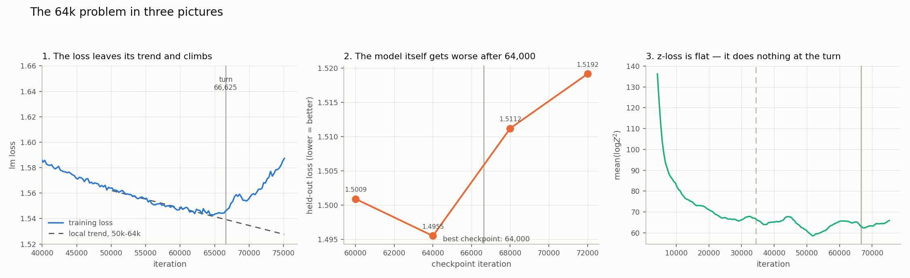

# The 64k problem: the 32B run gets worse with continued training

**Latest status:** training is paused and the cause is not yet confirmed. The
held-out loss is best at iteration 64,000 and worsens afterward. The change is
smooth rather than a failure at one exact step.

The leading open explanation is an overly aggressive optimization regime:
constant learning rate, very large batch, and growing curvature or reduced
plasticity. Production masking, optimizer sharding, FP8 quantization quality,
and BF16 residual additions still need stronger tests.

This page is intended to be readable without prior context and is the single
record for this investigation. The earlier working notes are archived at
[../archive/fp8-loss-turn/](../archive/fp8-loss-turn/); their conclusions are
superseded here and their measurements are quoted where they still hold.

---

## What is the issue?

We are training a 32-billion-parameter dense model with 64 layers, hidden size
5,120, sequence length 4,096, and global batch size 4,096. Each optimizer step
therefore contains about 16.8 million tokens. The full plan is 15 trillion
tokens, or about 894,000 iterations.

The loss improves normally at first. It then flattens and starts to rise. The
visible turn is near iteration 66,000, but later analysis suggests that the
departure from the healthy trend starts earlier, somewhere before 64,000.



### Evidence that the regression is real

1. **Training loss leaves its previous trend.**

   | iterations | loss change per 1,000 steps |
   |---|---:|
   | 50k–56k | −0.0018 |
   | 62k–66.6k | −0.0005 |
   | 66.6k–71k | +0.0023 |
   | 71k–75k | +0.0062 |

2. **Held-out loss also gets worse.** This shows that the effect is in the
   model weights, not only in training-loss logging.

   | checkpoint | held-out loss | job | W&B |
   |---|---:|---|---|
   | 60,000 | 1.500890 | `1548575` | [4nlzb9z3](https://wandb.ai/openeurollm-project/oellm_32b_dense_probe/runs/4nlzb9z3) |
   | **64,000** | **1.495481** | `1573075` | [n73hfjsd](https://wandb.ai/openeurollm-project/oellm_32b_dense_probe/runs/n73hfjsd) |
   | 68,000 | 1.511213 | `1563495` | [qbovy64e](https://wandb.ai/openeurollm-project/oellm_32b_dense_probe/runs/qbovy64e) |
   | 72,000 | 1.519173 | `1543640` | [bdinzdw8](https://wandb.ai/openeurollm-project/oellm_32b_dense_probe/runs/bdinzdw8) |

3. **BF16 evaluation gives the same result.** Re-scoring the 64k and 72k
   checkpoints without FP8 preserves 97% of the loss gap.

There are no NaNs, skipped steps, gradient-clipping events, or sudden gradient
spikes. This is therefore a smooth degradation, not an explosive numerical
divergence.

### Impact

The run stopped at iteration 75,125, after about 1.26 trillion tokens. That is
8.4% of the planned run. About 11,000 iterations, 185 billion tokens, and 27,500
GPU-hours were spent after the best held-out checkpoint.

**Main run:** `oellm_32b_dense_prod_dataopt5_gbs4096_lr3e-4`, last job
`1537344`, W&B run
[tjeg54n7](https://wandb.ai/openeurollm-project/oellm_32b_dense/runs/tjeg54n7).
The W&B runs are offline until `scripts/sync_runs.py` is run. The Slurm logs
under `/e/project1/e-sta-openeurollm/production_training/<run>/logs/` remain the
primary record.

---

## Potential causes

Each section has one of two statuses:

- **Closed:** the stated hypothesis has direct evidence against it. The scope of
  the conclusion is written explicitly.
- **WIP:** the hypothesis is still open, or the existing test is not sufficient.

“Closed” does not mean that a component is ideal. It means that the specific
hypothesis in that section does not explain the observed loss regression.

### 1. Incorrect loss measurement

**Status: Closed**

**Question:** Could FP8 evaluation make healthy weights appear worse?

**Evidence:** Checkpoints 64,000 and 72,000 were evaluated again with FP8
disabled.

| forward pass | 64,000 | 72,000 | gap |
|---|---:|---:|---:|
| FP8 | 1.495481 | 1.519173 | +0.023692 |
| BF16 | 1.494178 | 1.517163 | +0.022985 |

**Conclusion:** 97% of the gap remains in BF16. The later checkpoint contains
worse weights. Jobs: `1564918`, `1564919`.

### 2. Configuration change during training

**Status: Closed**

**Question:** Did a training setting change near the loss turn?

**Evidence:** The saved configuration is byte-identical by MD5 across the last
nine jobs, starting with job `1524558`.

**Conclusion:** No configuration file changed near the turn.

### 3. Learning-rate schedule event

**Status: Closed**

**Question:** Did the learning rate or batch size change near 64k–67k?

**Evidence:** Logs show a constant learning rate of `3e-4` and global batch size
4,096 throughout the interval. WSD decay is scheduled to start near iteration
804,600.

**Conclusion:** There is no scheduled event near the turn. This does **not** show
that `3e-4` remains stable throughout training. A constant learning rate becoming
too large for the later loss landscape is covered in items 23 and 29.

### 4. Checkpoint restart or resume handling

**Status: Closed**

**Question:** Did repeated resumes introduce a loss error?

**Evidence:** Loss was checked around all 12 resumes. Optimizer and RNG state
were restored, and there is no repeated level or slope change at restart points.
Item 20 separately tests the restart at iteration 66,625.

**Conclusion:** Ordinary checkpoint resumes do not explain the regression.

### 5. Data-mixture content or composition

**Status: WIP**

**Question:** Does one domain, language, source, or repeated subset become
harmful as training progresses?

**Current evidence:** Batch-to-batch loss variance is nearly constant across the
turn, and a different shuffle also degrades. These observations argue against a
short cluster of bad batches, but they do not test the content of the mixture.
The earlier comparison to `baby_9b_dense` was invalid because that run used a
different mixture.

**Open issue:** Evaluate checkpoint loss by source, domain, language, document
length, and document-relative token position. Also measure effective duplicate
and near-duplicate exposure. Nominal dataset epoch boundaries alone do not test
duplication inside a component.

### 6. A specific bad data order after 64k

**Status: Closed**

**Question:** Did the flagship encounter an unlucky sequence of batches after
64k?

**Evidence:** `cont2` forked from the 64k flagship checkpoint, used shuffle seed
4321, and still worsened by +0.0032 held-out loss by iteration 66,000. Job
`1558724`, W&B run
[921bmgjb](https://wandb.ai/openeurollm-project/oellm_32b_dense/runs/921bmgjb).

**Conclusion:** The specific post-64k batch order is not required. Because the
fork starts at 64k, this test does not exclude data history before 64k; that
remains part of item 5.

### 7. A specific set of machines after 64k

**Status: Closed**

**Question:** Did faulty nodes used by the flagship cause the continued rise?

**Evidence:** `cont2` used 468 different nodes out of 512 and still degraded.

**Conclusion:** The post-64k degradation is not tied to the flagship's node set.
The experiment does not test hardware effects already present in the inherited
64k checkpoint.

### 8. Arithmetic changes in the software-stack swap

**Status: Closed**

**Question:** Did the container, Transformer Engine 2.14→2.18, Megatron Core
0.16→0.19, or attention backend compute incorrect values after iteration
34,455?

**Evidence:**

| test | result |
|---|---|
| One checkpoint evaluated with three stacks | identical loss: `1.519173E+00` |
| TE 2.14 versus 2.18 gradient probe | identical loss and gradient norm |
| FP8 scale state across the swap | continuous; ratio 0.95–0.98 |
| Loss trajectory at the swap | level change, no measured slope change |

**Conclusion:** The tested forward and backward arithmetic is consistent across
the stack change. This does not cover the objective change from document masking
(item 10) or the data-parallel sharding change (item 22).

### 9. FP8 as the initiating cause

**Status: WIP**

**Question:** Does FP8 initiate the regression, amplify it, or both?

**Evidence:** `cont4` switched the flagship checkpoint at 60k to BF16 and reached
63,125. `cont4b` resumed that BF16 branch and reached 68k. It is therefore a BF16
continuation from 60k, not a direct flagship fork at 63,125.

| loss slope per 1,000 steps | before 66,625 | after 66,625 |
|---|---:|---:|
| flagship, FP8 | −0.00036 | +0.00904 |
| `cont4b`, BF16 | −0.00073 | +0.00391 |

Read on that window alone, the BF16 branch also turns upward, but more slowly.
That reading does not survive a longer window. Job `1619380` resumed the same
BF16 branch and reached 70,580, past the point where the two conclusions diverge:

| loss slope per 1,000 steps | FP8 | BF16 |
|---|---:|---:|
| 66,625–68,000 | +0.00904 | +0.00362 |
| 66,625–70,580 | +0.00233 | +0.00446 |
| 68,000–70,580 | −0.00023 | +0.00467 |

After 68,000 the flagship flattens while the BF16 branch continues at its earlier
rate. Measured from a shared 65,500–66,125 baseline to 70,000–70,600 the two rise
by the same amount: FP8 1.5444 to 1.5587 (+0.0143), BF16 1.5390 to 1.5535
(+0.0145). The −0.005 offset between the curves is constant across 63,500–70,600
and is the expected unquantised-forward offset, not a divergence.

The flagship plateau is not a restart artifact: 66,626–75,125 is a single job
(`1537344`) and the learning rate is 3.0e-4 throughout.

`1618489` and `1619380` are independent forks of the same 63,125 checkpoint and
agree to 0.0007 across matched windows, so the +0.0145 rise is about twenty times
the run-to-run noise.

Note on provenance: the first BF16 segment, job `1576287` (60,000–60,367), logged
no iteration lines to slurm. Its metrics exist only in wandb
(`offline-run-20260831_215533-22veosbj`), because srun dropped stdout under the
NVTE_DEBUG flood that produced a 14 GB log. Re-deriving these curves from logs
alone silently omits that segment.

**Current conclusion:** FP8 is not required for the regression to continue after
60k. On the 66,625–68,000 window it appears to amplify the rate of degradation,
but on 66,625–70,580 the BF16 slope is the larger of the two and the cumulative
rise is equal, so the two branches differ in the shape of the turn rather than
its magnitude. Because the possible onset may be earlier than 60k, this
experiment cannot exclude an FP8 contribution already stored in the 60k weights.

**Open issue:** Start a BF16 branch before the earliest plausible onset, or use
earlier BF16-trained weights. Measure FP8 quantization error as described in item
15.

### 10. Inter-document masking and packed-sequence handling

**Status: WIP**

**Question:** Did enabling per-document attention masking at iteration 34,455
introduce a harmful objective or implementation error?

**Current evidence:** The masking flags were inert before 34,455 and active
afterward. The loss has a +0.00365 level change at the swap, but continues to
improve for about 26,000–32,000 iterations. `cont3` changed the entire old stack,
so it does not isolate masking.

The existing packed-document unit test validates formats, queues, and shapes. It
does not prove end-to-end loss and gradient equivalence under the production
PP=4/VPP=4 path.

**Open issue:**

1. Score 60k, 64k, 68k, and 72k with and without masking.
2. Stratify loss by document position, boundary position, and documents per pack.
3. Compare the same minibatch under a simple PP=1 reference and production
   PP/VPP, including tokens, labels, position IDs, `cu_seqlens`, loss, and
   gradients.
4. Run `cont6`, the one-variable masking-off continuation, only if the cheap
   evaluation tests show a meaningful difference.

### 11. Missing zero-centered gamma

**Status: Closed**

**Question:** Would zero-centered RMSNorm gains prevent the turn?

**Evidence:** With no weight decay on the gains,
`gamma * x_hat` and `(1 + gamma') * x_hat` are equivalent parameterizations.
Measured gains also change smoothly rather than showing a new population-level
failure near the loss turn.

**Conclusion:** The parameterization itself is not the cause. It also cannot be
enabled when loading the current checkpoints without converting the stored gain
values, because an unchanged gain near 1 would become an effective gain near 2.

### 12. Individual RMSNorm channels switching off

**Status: Closed**

**Question:** Are increasing numbers of channels becoming inactive because their
RMSNorm gains approach zero?

**Evidence:** The original statistic was the minimum over thousands of channels,
which is unstable as a distribution widens. The replacement scan counts the
fraction of channels below 1%, 10%, 25%, and 50% of their layer median.

| tensor | change in minimum/median | worst fraction below 10% of median |
|---|---:|---:|
| `pre_mlp_layernorm` | 0.799→0.00136 | 0.0000→0.0020 |
| `input_layernorm` | 0.926→0.0524 | 0.0000→0.0002 |
| `q_layernorm` | 0.421→0.00013 | 0.0000→0.109 |
| `k_layernorm` | 0.373→0.00063 | 0.0000→0.141 |
| `final_layernorm` | 0.784→0.118 | 0.0000→0.0000 |

The population fractions are flat through the loss-turn window. Script:
[../../scripts/scan_gain_distribution.py](../../scripts/scan_gain_distribution.py).

**Conclusion:** A few extreme channels explain the falling minimum; there is no
growing population of inactive channels. This test is relative to each layer's
median and therefore does not cover uniform shrinkage of an entire layer. Layer
0 is treated separately in item 30.

### 13. FP8 overflow from activation growth

**Status: Closed**

**Question:** Do growing activations exceed the FP8 range?

**Evidence:** Transformer Engine amax histories were read from 22 checkpoints.
Only inputs not immediately bounded by normalization, mainly `linear_proj` and
`linear_fc2`, grow substantially. The growth begins by iteration 4,000 and slows
after the stack swap. Median `scale_fwd` is approximately 9.8 from iteration
16,000 onward, with no recorded non-finite values or overflow event.

**Conclusion:** Recorded activation overflow does not explain the turn. This test
does not measure loss of precision for typical values inside an outlier-scaled
tensor; that remains open in item 15.

### 14. Weight growth and outliers

**Status: WIP**

**Question:** Do growing weight norms or outliers reduce plasticity or FP8
precision?

**Current evidence:** Weight growth is real, especially in output projections.

| tensor, median over layers | RMS growth 8k→75k | max/RMS 8k→75k |
|---|---:|---:|
| `self_attention.linear_qkv` | 1.86× | 6.1→13.2 |
| `mlp.linear_fc2` | 4.18× | 6.0→48.2 |

BF16 branches show a similar `fc2` max/RMS ratio near 64k, so FP8 is not required
to create the tail. The available flagship weight statistics cover only six
checkpoints, including a gap from 34,454 to 60,000.

A controlled version of the comparison exists. `cont4` forks the flagship at
60,000 and reaches 64,000, so FP8 and BF16 run the same 4,000 steps from
bit-identical starting weights, the only difference being numerics. The fork
doubles as a correctness check on the scan: at 60,000 the two runs must agree
exactly on all eight quantities, and they do, for example `linear_fc2` max|W| of
1.78906 in both.

| growth 60,000 to 64,000 | max\|W\| FP8 | max\|W\| BF16 | rms\|W\| FP8 | rms\|W\| BF16 |
|---|---:|---:|---:|---:|
| `linear_qkv` | +3.22% | +2.07% | +1.60% | +1.17% |
| `linear_proj` | +5.67% | +8.51% | +1.79% | +1.15% |
| `linear_fc1` | +4.87% | +5.19% | +1.13% | +1.11% |
| `linear_fc2` | +1.75% | +1.75% | +1.44% | +1.34% |

Weight growth is not FP8-specific; on `linear_proj` the BF16 control grows half
again as fast. The outlier/bulk split is real, max|W| running about 9x over the
flagship run against about 3x for rms|W|, but it holds equally in BF16. Figure:
[weight_control.png](weight_control.png), regenerate with
[../../scripts/plot_weight_control.py](../../scripts/plot_weight_control.py)
from `data/weight_stats.csv`.

This window ends at 64,000, before the turn at 66,625, so it establishes that
weight growth is normal in the run-up, not that it stays normal afterwards. BF16
checkpoints past 64,000 now exist, from jobs `1620342` (to 68,000) and `1619380`
(to 70,580), so the post-turn window can be scanned.

**Open issue:** The current measurements do not establish whether the tails harm
representations, optimization, or FP8 signal-to-noise. Measure actual updates,
activation outliers, and quantization error by layer and checkpoint. This item is
closely related to plasticity (item 31) and FP8 quantization quality (item 15).

### 15. FP8 scaling-state corruption or poor quantization quality

**Status: WIP**

**Question:** Is the FP8 scaling state wrong, or is a correct scale still too
coarse for most tensor values?

**Evidence:** The bookkeeping part is closed: all 22 checkpoint `_extra_state`
records are finite, `scale == fp8_max / amax`, and scales are continuous across
the stack swap. Median `scale_fwd` is flat.

However, delayed per-tensor scaling follows the largest values. A rising max/RMS
ratio can reduce precision for typical values even when the recorded amax and
scale are correct.

**Open issue:** Measure quantize/dequantize MSE, cosine error, zero fraction, and
clipping fraction for weights, activations, forward gradients, and backward
gradients. Report them by layer and checkpoint, with special attention to
`linear_fc2`, late layers, and the first/last layers.

### 16. Weight decay crushing the weights

**Status: Closed**

**Question:** Is constant weight decay `0.05` steadily reducing useful weights?

**Evidence:** Model-wide weight RMS rises from 0.016688 to 0.017121, and no
scanned decoder-layer matrix shrinks over the measured interval.

**Conclusion:** Weight decay is not globally shrinking the model. Its interaction
with actual Adam updates can still be studied under item 19.

### 17. LM-head z-loss

**Status: WIP**

**Question:** Does the added z-loss become too influential as cross-entropy
gradients change?

**Evidence:** The reported loss is not contaminated because the implementation
adds `z_loss - z_loss.detach()`: it changes gradients but not the logged value.
The term is active from the first job, and its diagnostic is broadly flat after
20k.

| iteration | 4k | 24k | 34,455 | 64k | 66,625 | 68k | 75,125 |
|---|---:|---:|---:|---:|---:|---:|---:|
| mean(logZ²) | 144.1 | 66.2 | 65.8 | 64.5 | 62.5 | 62.9 | 65.3 |

**Current conclusion:** z-loss does not explain the reported loss value and has
no obvious value-level transition. A flat auxiliary loss does not prove that its
gradient remains negligible relative to the shrinking cross-entropy gradient.

**Open issue:** Measure cross-entropy and z-loss gradient norms and their cosine
by module at several checkpoints. The production coefficient is `1e-4`;
`final_logit_softcapping` is disabled.

### 18. QK-norm growth and attention-entropy collapse

**Status: WIP**

**Question:** Do growing QK-norm gains make attention too sharp or otherwise
damage the attention pattern?

**Current evidence:** Mean Q and K gains grow from about 1.20 to 1.50 between 8k
and 75k. A first entropy probe found no mean collapse:

| checkpoint | mean entropy, nats | most concentrated sampled layer |
|---|---:|---:|
| 48k | 3.064 | 1.977 |
| 60k | 3.039 | 1.994 |
| 64k | 2.968 | 1.942 |
| 68k | 2.967 | 2.002 |
| 72k | 3.022 | 2.045 |
| 75,126 | 3.040 | 2.100 |

The probe does not reproduce production packed attention: it ignores the passed
document mask, creates a dense causal mask with monotonic positions, samples only
every eighth head, and uses one fixed batch. See
[../../scripts/scan_attention_entropy.py](../../scripts/scan_attention_entropy.py).

**Open issue:** Repeat the measurement with real production masks and position
resets, several batches, and every head. Report per-head and per-position
distributions, not only layer means. The existing result rules out a large mean
collapse in the sampled synthetic setting; it does not close production
attention pathologies.

### 19. Adam state, epsilon, and actual update size

**Status: WIP**

**Question:** Does Adam state suppress or redirect useful updates near the loss
turn?

**Current evidence:** The scans find no obvious timing signal: sampled
`sqrt(v)` and the proxy update are roughly flat before 64k and rise afterward.
This is more consistent with a response to rising loss than with an earlier cause.

Quantifying that from `data/optimizer_state_spread.csv`, as the size-weighted
mean of per-shard `rel_step_p50` over eight shards covering 3.21B parameters:

| iteration | 44k | 48k | 52k | 56k | 60k | 64k | 68k | 72k | 75,126 |
|---|---:|---:|---:|---:|---:|---:|---:|---:|---:|
| weighted `rel_step_p50` | 4.22 | 4.47 | 4.07 | 3.96 | 3.91 | 3.68 | 4.23 | 4.05 | 4.47 |
| change from previous | — | +5.8% | −8.9% | −2.7% | −1.0% | −6.0% | +14.9% | −4.2% | +10.3% |

The normalized update rises 14.9% from 64k to 68k, which is the largest single
step in the series and coincides with the turn. It is not yet evidence, for two
reasons. The same series moves +5.8% at 48k and −8.9% at 52k, well before the
onset, so the step-to-step scatter is roughly 8% and a 14.9% move is about
1.7 standard deviations. The narrower five-shard sample in
`data/optimizer_state.csv`, covering 1.49B parameters, puts the same interval at
+9.4%. The direction is consistent across both samples; the magnitude is not
resolved.

The current aggregation is not sufficient for model-wide quantitative claims.
[../../scripts/plot_optimizer_turn.py](../../scripts/plot_optimizer_turn.py)
computes a size-weighted average of per-shard medians, which is not a global
median. It also derives epsilon suppression from that aggregate instead of from
individual parameters. Eight lexicographically spread shards cover 9.5% of the
model but are not a random sample.

**Open issue:** Stream the actual tensors and compute, per parameter,

```text
s_i = eps / (sqrt(v_i) + eps)
u_i = m_i / (sqrt(v_i) + eps)
```

Then aggregate true quantiles and `||u|| / ||w||` by named tensor, module, and
pipeline stage. Separate radial updates from updates orthogonal to the weight.
Compare the actual update to an `eps -> 0` counterfactual.

**Current conclusion:** There is no validated evidence that `adam_eps=1e-8`
causes the turn or slows the whole model by a specific percentage. Do not change
it to `1e-15` without an ablation.

### 20. The restart at iteration 66,625

**Status: Closed**

**Question:** Did job `1537344` introduce the turn when it resumed at exactly
66,625?

**Evidence:**

| run | nearby restart pattern | loss turns? |
|---|---|---|
| flagship | resume at 66,625 | yes |
| `cont4b` | resume at 66,125 | yes |
| `cont2` | no resume from 64,000 to 66,520 | yes |

**Conclusion:** The turn occurs under three different restart patterns. The
66,625 restart is a coincidence, not the cause.

### 21. A dataset component reaching an epoch boundary

**Status: Closed**

**Question:** Did a blend component run out and begin repeating near the turn?

**Evidence:** Epoch boundaries were calculated from all 452 component token
counts and mixture weights using
`iteration = tokens_i / (weight_i * 4096 * 4096)`.

| check | result |
|---|---:|
| metadata files read | 452/452 |
| earliest nominal epoch boundary | 222,700 |
| components wrapping from 60k–72k | 0 |
| blend weight exhausted before 66,625 | 0.0000 |

**Conclusion:** No component reaches its first nominal epoch boundary near the
loss turn. This does not measure duplicate content within a component; that is
part of item 5.

### 22. Distributed-optimizer sharding

**Status: WIP**

**Question:** Did changing `data_parallel_sharding_strategy` from `no_shard` to
`optim_grads_params` affect reductions or optimizer state?

**Current evidence:** The change occurred at iteration 34,455. Existing forward
and small-scale gradient probes do not exercise the 512-node data-parallel path.
Timing is weak evidence against it because training improved for many iterations
after the change.

**Open issue:** A small-scale loss divergence between sharding modes would be
ambiguous because reduction order is expected to change. Prefer a controlled
one-step comparison of reduced gradients, optimizer state, and parameter updates
against a higher-precision reference. If possible, reproduce the production
topology or its reduction groups.

### 23. Curvature and Adam edge of stability

**Status: WIP**

**Question:** Does a constant learning rate become unstable as curvature grows?

This mechanism fits the smooth, progress-dependent behavior and does not require
a configuration event. It could also occur without NaNs or clipping.

**Attempted test:**
[../../scripts/scan_sharpness.py](../../scripts/scan_sharpness.py) used finite
differences on one decoder layer at sequence length 512. The result is invalid:

- The perturbation was often below BF16 parameter resolution.
- The same 64k checkpoint produced 0.0470 with five power iterations and 0.0234
  with 25, which is inconsistent with a stable power-iteration estimate.
- A single-layer, short-sequence Hessian is only a partial view of the model.
- The SGD rule `lr * lambda_max < 2` does not apply directly to Adam. The relevant
  object is the preconditioned Hessian.

**Open issue:** Implement exact double-backward HVPs and estimate the leading
eigenvalue of the Adam-preconditioned Hessian. Use checkpoints before and around
the possible onset, for example 34,455, 40k, 48k, 56k, 60k, and 64k. Validate the
operator on a small model before interpreting the 32B result.

### 24. Rank collapse and functional loss of capacity

**Status: WIP**

**Question:** Are weights or activations becoming low-rank as training proceeds?

**Current evidence:** No decoder weight matrix shrinks, and row norms do not show
a large dead population. Those checks do not measure functional activation rank.

**Open issue:** Measure stable rank of representative weight matrices, but give
higher priority to activation covariance, effective rank, and per-neuron SwiGLU
gate/up/product statistics on real production batches. A neuron can be
functionally inactive even when its weight-row norm is nonzero.

### 25. Embedding and output-layer collapse

**Status: Closed**

**Question:** Do the 1.34B-parameter input embedding or untied output layer
degrade near 64k?

**Evidence:**

| iteration | embed RMS | embed absmax | output RMS | output absmax |
|---|---:|---:|---:|---:|
| 8k | 0.02125 | 0.137 | 0.01864 | 0.239 |
| 34,454 | 0.02737 | 1.063 | 0.01803 | 0.303 |
| 64k | 0.02816 | 1.141 | 0.01830 | 0.350 |
| 75,126 | 0.02875 | 1.227 | 0.01840 | 0.412 |

No token rows fall below 10% of the median row norm at any measured checkpoint.
The output RMS remains nearly constant, and all changes are smooth. Data:
`data/embed_output.csv`.

**Conclusion:** There is no gross embedding or output-layer collapse near the
turn. Token-frequency-stratified loss remains useful under item 5.

### 26. Batch size and gradient-noise scale

**Status: WIP**

**Question:** Is 16.8 million tokens per optimizer step beyond the useful or
stable batch range for this model?

**Current evidence:** The batch is constant, so it is not a discrete event. A
very large batch can still reduce beneficial gradient noise, interact with
curvature, and make a high constant learning rate less forgiving. No gradient
noise-scale measurement has been made for this run.

**Open issue:** Estimate gradient noise scale from multiple microbatch gradients
at representative checkpoints. A training ablation should vary batch and
learning rate together so that token budget and optimizer-step count are
interpretable.

### 27. A discrete event at iteration 66,625

**Status: Closed**

**Question:** Is 66,625 a real breakpoint where something suddenly changes?

**Evidence:** Smooth polynomial models fit the 40k–75k training-loss curve better
than a kink or a level-and-slope breakpoint at the same parameter count.

| model | parameters | RSS | delta BIC |
|---|---:|---:|---:|
| quartic, smooth | 5 | 0.1904 | 0 |
| cubic, smooth | 4 | 0.1968 | 224 |
| kink | 4 + location | 0.2074 | 595 |
| level and slope breakpoint | 4 + location | 0.2074 | 603 |

Fits against a decreasing baseline place the departure somewhere before 64k.
The onset and growth exponent are strongly coupled: plausible fits range from
about 52k with a steep exponent to about 64k with a shallow exponent. Residuals
are also autocorrelated.

**Conclusion:** There is no supported instantaneous event at 66,625. The safest
statement is: **the loss departs smoothly from its healthy trend before 64k**.
The exact onset and a specifically quadratic growth law are model-dependent.
Script: [../../scripts/fit_onset.py](../../scripts/fit_onset.py).

### 28. Dating the onset in other saved metrics

**Status: Closed**

**Question:** Can the existing checkpoint scans identify which internal metric
changes first?

**Evidence:** Checkpoints were saved every 4,000 iterations. Only about seven
points are available between the stack swap and the possible onset. Two
extrapolation methods failed their healthy-window negative controls, with maximum
absolute z-scores of 27.3 and 7.8. Per-step gradient norm passes the control but
shows only a gentle decline and a transient spike near 55,200.

**Conclusion:** The current saved checkpoints cannot date an internal onset
reliably. Future continuations through this region should save every 500 steps.
This closes the measurement question, not the underlying mechanisms.

### 29. Aggressive optimization with too little regularization

**Status: WIP**

**Priority:** Leading hypothesis family.

**Question:** Is the combination of constant high learning rate, very large
batch, and unregularized norm gains unsuitable for the full run?

| setting | this run |
|---|---|
| learning rate | constant `3e-4` until about 804,600 |
| global batch | 16.8M tokens per step from the start |
| batch ramp | none |
| QK-norm gain weight decay | `0.0` |
| residual-norm gain weight decay | `0.0` |

The phrase “no restoring force” is too broad: ordinary weights have weight decay,
the logits have z-loss, and Q/K vectors are normalized. The precise concern is
that several relevant controls do not change over training, while norm gains are
excluded from weight decay.

**Current evidence:** This family matches the smooth progress dependence and is
shared by FP8 and BF16. It is still a coherence argument, not a direct
measurement. A scaling-law LR estimate is informative but not an exact stability
threshold.

**Open issue:** Run a controlled learning-rate dose response and the curvature
and noise-scale tests in items 23 and 26. Consider a factorial test with residual
precision from item 32.

### 30. Uniform attenuation of layer-0 attention

**Status: Closed**

**Question:** Does the 22-fold fall in layer-0 input-norm gain cause the global
loss turn?

**Evidence:** Layer-0 `input_layernorm` RMS falls from 0.9464 at 8k to 0.0423 at
75,126. This is a uniform layer-scale change, so the relative-channel test in
item 12 cannot see it. Weight growth compensates part of the change:

| layer-0 path, relative scale | 8k | 60k | 75,126 |
|---|---:|---:|---:|
| `pre_mlp_layernorm * W_fc1` | 1.000 | 0.955 | 0.912 |
| `input_layernorm * W_qkv * W_proj` | 1.000 | 0.447 | 0.356 |

QK normalization protects the attention pattern, so the remaining effect is
mainly on value/output scale. Only layer 0 falls below half its starting scale,
and most of the decline is complete before the possible onset.

Item 33 measures the same path directly rather than through a scale proxy, and
the absolute reading above does not survive it. Layer 0's attention is the
dominant writer at that depth: it puts out rms 5.24 into a residual stream of rms
0.042, the raw token embedding, at a cosine of 0.009, so it is writing the
initial representation rather than refining one. In absolute terms the branch
output grew, 1.79 to 5.24 between 8,000 and 75,126. Its share peaked at 24,000
rather than at the start, and the decline since, 215x to 119x, is smooth,
decelerating, and still above the 8,000 value.

**Conclusion:** Layer-0 attention attenuates relative to its 24,000 peak, but it
does not switch off and its output grows in absolute terms. Timing and
localization do not support it as the primary cause of the model-wide
regression. The scale products here are RMS proxies, not exact operator norms;
the RMS of a matrix product is not the product of the RMS values when the
weights are correlated or the input is anisotropic, which is why the proxy
overstated the effect.

### 31. Loss of plasticity and effective parameter updates

**Status: WIP**

**Question:** Does weight growth reduce the model's ability to change useful
representations?

**Current evidence:** Inverse weight RMS, used as a rough proxy for Adam's
relative update scale, falls by about 2–4× from 8k to 75k in several projections.
Most of the change occurs before 34k and then decelerates.

| tensor, proxy relative to 8k | 34k | 60k | 64k | 75k |
|---|---:|---:|---:|---:|
| `mlp.linear_fc1` | 0.599 | 0.529 | 0.524 | 0.502 |
| `mlp.linear_fc2` | 0.302 | 0.255 | 0.251 | 0.240 |
| `self_attention.linear_proj` | 0.305 | 0.254 | 0.249 | 0.234 |
| `self_attention.linear_qkv` | 0.672 | 0.588 | 0.578 | 0.543 |

Inverse weight RMS is not the actual effective learning rate. Adam updates vary
by parameter, and only the component that changes the weight direction directly
captures representational rotation.

**Open issue:** Use optimizer state or adjacent FP32 master checkpoints to measure
`||delta w|| / ||w||`, update/weight cosine, and radial versus orthogonal update
components by tensor. Combine this with activation-rank and SwiGLU-use statistics
from item 24.

### 32. BF16 residual-add precision

**Status: WIP**

**Priority:** High-priority missing test.

**Question:** Are small attention or MLP branches being rounded away when added
to a growing BF16 residual stream?

**Current evidence:** `fp32_residual_connection` is disabled. In the current
`data/residual_stream.csv` snapshot, median hidden-state RMS rises from about 24
at 8k to 111 at 64k. At the final layer of the 64k checkpoint, attention-branch
RMS is about 0.85% of shortcut RMS. That is close enough to BF16 spacing to make
partial elementwise loss plausible, but an RMS ratio is not a rounding test.

The probe also uses one fixed batch with dense causal positions rather than the
production packed-document objective. Some last-layer MLP ratios vary greatly
between checkpoints, so multiple batches are required.

**Open issue:**

1. At each residual add, measure the fraction for which
   `bf16(hidden + branch) == hidden`.
2. Compare BF16 and FP32 sums using relative L2 error and cosine, by layer and
   token position, on several production batches.
3. Re-score 60k, 64k, 68k, and 72k with FP32 residual additions.
4. If checkpoint degradation is smaller with FP32 additions, run a short
   continuation with `fp32_residual_connection: true`.

### 33. Per-layer residual-stream budget

**Status: Closed**

**Question:** Is any layer doing less work than it used to? Gain plots cannot
answer this, because a RMSNorm gain and the weight it feeds are a degenerate
pair: only the product `gain x W` changes the function, so a shrinking gain
beside a growing weight is bookkeeping (item 14). The quantity independent of
that split is what each branch writes into the residual stream, measured against
the stream itself, `attn_share = rms(Attn(RMSNorm(h) * g)) / rms(h)`.

**Evidence:** [../../scripts/scan_residual_stream.py](../../scripts/scan_residual_stream.py)
hooks all 64 layers and runs one forward pass per checkpoint on a fixed sequence,
the same tokens every time, so the comparison is controlled. Nine checkpoints
from 8,000 to 75,126, about six minutes each on one login-node GH200. Figure:
[residual_stream.png](residual_stream.png), data `data/residual_stream.csv`.

| iteration | 8,000 | 24,000 | 34,454 | 44,000 | 56,000 | 60,000 | 64,000 | 68,000 | 75,126 |
|---|---:|---:|---:|---:|---:|---:|---:|---:|---:|
| attn share, median L2-61 | 0.042 | 0.068 | 0.070 | 0.072 | 0.068 | 0.073 | 0.071 | 0.069 | 0.069 |
| MLP share, median L2-61 | 0.138 | 0.151 | 0.140 | 0.144 | 0.141 | 0.142 | 0.140 | 0.140 | 0.133 |
| attn share, layer 0 | 85x | 215x | 197x | 161x | 133x | 127x | 125x | 121x | 119x |
| stream rms at layer 30 | 23.6 | 65.0 | 77.5 | 89.2 | 96.1 | 99.6 | 100.9 | 103.8 | 110.7 |

There is no functional collapse anywhere. Both branch shares are flat from 24,000
on, straight through the onset. Comparing 24,000 with 64,000 per layer, the
weakest is layer 0 at 0.58x and nothing else falls below 0.68x, while mid-stack
layers grow, L37 at 1.54x, and layer 63's MLP grows 3.53x. The bottom of the
stack hands work to the middle and top: redistribution, not collapse.

The residual stream grows smoothly and decelerates. At layer 30 it goes 23.6 to
110.7, and at layer 60 50.5 to 412.2, monotone at every depth with no feature at
the onset. Because the branch shares are flat, the branches grow with it and
nothing is being drowned out. Nothing moves at 60,500.

**Conclusion:** No layer stops contributing, and the branch/stream ratios carry
no signal at the turn. This removes functional collapse as a cause and corrects
the absolute reading in item 30.

**Open issue:** One unconfirmed observation. Layer 61's attention branch jumps
from 6.89 to 30.28 rms between 68,000 and 75,126, against a series that is
smooth everywhere else: 1.16, 3.04, 5.11, 4.98, 5.45, 6.01, 6.28, 6.89, 30.28.
It is one layer in one checkpoint after the onset, and it barely moves the stream
it is added to, 427 to 447, so it is consistent with a few very large values
rather than a broad shift. It needs a second input sequence before it means
anything.

---

## Run index

Run names are deterministic: `<run-directory-name>_<SLURM_JOB_ID>`. Logs are at
`/e/project1/e-sta-openeurollm/production_training/<run-directory-name>/logs/slurm-<job>.log`,
and `config-<job>.yaml` beside them is the configuration that job actually ran.
Check that file rather than trusting a run name. W&B URLs are
`https://wandb.ai/openeurollm-project/<project>/runs/<id>`.

`/e/scratch/.../production_training/` holds directories with the same names but
contains only checkpoints: no logs, no configs, no wandb directories. A run that
appears to have no evidence is usually being looked for on the wrong file
system.

| run | job | id | project |
|---|---|---|---|
| flagship, old stack (to 34,450) | `1516079` | `uaewx25r` | `oellm_32b_dense` |
| flagship, new stack (34,455 on) | `1524558` | `eef62uvs` | `oellm_32b_dense` |
| flagship, the broken stretch | `1537344` | `tjeg54n7` | `oellm_32b_dense` |
| cont2 (seed 4321) | `1558724` | `921bmgjb` | `oellm_32b_dense` |
| cont3 (old stack) | `1563277` | `59cgca5p` | `oellm_32b_dense` |
| cont5 (crashed) | `1566470` | `u0ym9e9h` | `oellm_32b_dense` |
| bf16 eval at 64k | `1564918` | `cyw7md2r` | `oellm_32b_dense_probe` |
| bf16 eval at 72k | `1564919` | `63y7kx56` | `oellm_32b_dense_probe` |
| stack probe FA3 at 72k | `1543640` | `bdinzdw8` | `oellm_32b_dense_probe` |
| stack probe cuDNN at 72k | `1548568` | `haao7dqu` | `oellm_32b_dense_probe` |
| stack probe nemo26.04 at 72k | `1548574` | `h70nuvhz` | `oellm_32b_dense_probe` |
| stack probe FA3 at 60k | `1548575` | `4nlzb9z3` | `oellm_32b_dense_probe` |
| ladder flagship 64,000 | `1573075` | `n73hfjsd` | `oellm_32b_dense_probe` |
| ladder flagship 68,000 | `1563495` | `qbovy64e` | `oellm_32b_dense_probe` |
| ladder cont2 65,000 | `1563497` | `cqcarvfh` | `oellm_32b_dense_probe` |
| ladder cont2 65,500 | `1563500` | `0hxqfqu8` | `oellm_32b_dense_probe` |
| ladder cont2 65,625 | `1563502` | `0jmlocsy` | `oellm_32b_dense_probe` |
| ladder cont2 66,000 | `1563494` | `toq5cc6t` | `oellm_32b_dense_probe` |

The BF16 branch from 60k is four segments, each resuming from a rolling
checkpoint slightly behind where the previous one stopped, so the seams overlap
by 90 to 120 iterations:

| segment | job | id | iterations |
|---|---|---|---|
| cont4, first | `1576287` | `22veosbj` | 60,000–60,367 |
| cont4, second | `1580164` | `yejlm5uz` | 60,251–63,220 |
| cont4, third | `1619380` | `k79pnix8` | 63,126–70,580 |
| cont4b, replica | `1618489` | `sksjido2` | 63,126–66,151 |
| cont4b, replica | `1620342` | `td7t0a6m` | 66,126–68,000 |

`1576287`, `1580164` and `1619380` form one continuous branch to 70,580. The two
`cont4b` jobs are an independent fork of the same 63,125 checkpoint, so they
duplicate 63,126–68,000 rather than extending it; plotted together they also
give a run-to-run noise floor of 0.0007. Job `1576287` logged no iteration lines
to slurm and is readable only in wandb, for the reason given under operational
notes.

The five `attnprobe-*` jobs (`1574335`, `1574334`, `1574662`, `1574661`,
`1574828`) wrote no wandb directory; their loss and gradient norm are in the
slurm logs at full printed precision. The FP8 amax audit is an offline script
over checkpoints, not a run. Everything else wrote an offline wandb directory at
`<run>/wandb/offline-run-*`, whose suffix is the run id in these tables, so the
ids are checkable on disk before anything is synced.

---

## Operational notes

Two configuration settings cost significant time and should not be reintroduced.

**`log_max_attention_logit: true`** makes Transformer Engine disable every fused
attention kernel, leaving only the unfused path. That path either runs out of
memory at production shape or, when `attention_backend: flash` is pinned, fails
with `ValueError: No dot product attention backend is available`. It killed
about eight consecutive 512-node starts, roughly 700 GPU-hours: jobs `1565251`,
`1566161`, `1567010`, `1573069`, `1573297`, `1573378`, `1574997`, `1575141` on
the cont4 branch and `1565209`, `1565895`, `1566470` on cont5. Because the
setting lived only in the BF16 forks, "BF16" and "this flag" were initially
indistinguishable as causes.

**`attention_backend: flash`** does not work in BF16 with document masking
(`thd` and `cu_seqlens`); use `auto`, which selects cuDNN. This costs nothing
scientifically, as FA3 and cuDNN measure identically to six decimals (items 8
and the stack probes in the run index).

**Debug logging at 512 nodes.** `NVTE_DEBUG_LEVEL=2` prints the backend
selection block on every attention call on every rank. Job `1576287` produced
8,464,730 such lines and a 14 GB log, and srun dropped its stdout, so that job's
iteration lines are absent from slurm entirely while the metrics reached wandb
normally. The settings have been removed from the configuration. Any curve
re-derived from logs alone silently omits that segment.

---

## Logbook

- **2026-08-24:** The flagship run starts, job `1485573`.
- **2026-08-28, iteration 34,455:** Container, Transformer Engine, Megatron Core,
  attention backend, optimizer sharding, and document masking change. Training
  continues to improve afterward.
- **2026-08-30:** The flagship stops at iteration 75,125 after the loss has risen
  for about 8,500 iterations.
- **2026-08-31 to 2026-09-01:** Initial checks cover configuration, scheduled LR,
  restarts, BF16 evaluation, norm gains, FP8 amax, and weight statistics.
- **2026-09-02:** The BF16 continuation reaches 68k and also turns upward. On
  that window it appears to do so more slowly than FP8; the extension recorded
  the next day shows that reading to be an artifact of stopping at 68k. Software
  arithmetic, z-loss values, sampled attention entropy, and optimizer state are
  probed.
- **2026-09-03:** Dataset epoch boundaries, embeddings, layer-0 attenuation,
  onset models, and gain-distribution statistics are examined. The first
  finite-difference sharpness measurement is rejected as invalid. The per-layer
  residual-stream scan closes functional collapse and corrects the absolute
  reading in item 30. The BF16 branch is extended to 70,580, which reverses the
  earlier reading that FP8 halves the rate of degradation. Earlier working notes
  are archived. Training remains paused.

---

## Current assessment

### What is established

- The regression is present in held-out loss and BF16 evaluation.
- It is smooth and begins before the visible crossing near 66k.
- No scheduled configuration, learning-rate, batch-size, or restart event occurs
  at the turn.
- The same post-60k pattern continues with BF16, a different post-64k data order,
  a largely different node set, and different restart boundaries.
- FP8 changes the shape of the turn after 60k but not its size: over
  66,625–70,580 the BF16 slope is the larger of the two, and both branches rise
  by the same +0.014 from a shared pre-turn baseline. Its possible earlier
  contribution is not yet isolated.
- No layer stops contributing. Attention and MLP shares of the residual stream
  are flat from 24k through the onset, and the stream itself grows smoothly and
  decelerates (item 33).
- Eighteen of the thirty-three items are closed, covering loss measurement,
  configuration drift, the scheduled learning rate, restart and resume handling,
  data order, the node set, stack arithmetic, zero-centred gamma, per-channel
  norm collapse, FP8 overflow, weight decay, the 66,625 restart, dataset epoch
  boundaries, embedding collapse, and functional collapse of any layer
  (items 1-4, 6-8, 11-13, 16, 20, 21, 25, 27, 28, 30, 33).

These continuations inherit flagship weights from 60k or 64k. They therefore
test what is required for the regression to **continue**, not every process that
may have created the checkpoint state before the fork.

### Open hypotheses, grouped by priority

1. **Optimization regime:** LR dose response, Adam-preconditioned curvature,
   gradient-noise scale, and actual update-to-weight ratios. The normalized Adam
   step rises 14.9% from 64k to 68k on the widest sample available, the largest
   single move in that series and coincident with the turn, but at about 1.7
   standard deviations of the series' own scatter it is suggestive rather than
   established (item 19).
2. **Numerical precision:** BF16 residual additions and FP8 quantization error,
   especially in layers with large outlier ratios.
3. **Production objective and distribution:** packed-document masking,
   PP/VPP correctness, and loss by data source and document position.
4. **Representation health:** activation rank, SwiGLU use, and functional
   plasticity. Functional collapse itself is closed by item 33; what remains is
   whether the representation is still *usable*, not whether branches still
   fire.
5. **Lower-priority open items:** distributed-optimizer sharding and z-loss
   gradient share.

### Recommended next experiments

1. **Cheap checkpoint evaluations first.** Score 60k/64k/68k/72k using real
   packed batches under BF16 GEMMs, with production versus disabled masking and
   BF16 versus FP32 residual additions.
2. **Learning-rate dose response.** From the same checkpoint, compare `3e-4`,
   `2e-4`, and `1e-4`, with evaluation every 250–500 steps. A lower-LR arm merely
   decreasing is not decisive because decay normally improves loss. Look for an
   ordered dose response and recovery toward the earlier trend.
3. **Validate production masking.** Compare PP=1 reference loss and gradients
   against the PP=4/VPP=4 path on the same minibatch.
4. **Measure actual numerics and updates.** Add residual-rounding, FP8 SQNR, and
   parameterwise Adam-update diagnostics. The shard-sampled form of the last of
   these now exists (item 19); what is missing is the per-parameter version and
   a global rather than shard-weighted aggregate.
5. **Run exact preconditioned HVPs** after validating the method on a smaller
   model.

If resources permit, a compact 2×2 continuation—learning rate `3e-4` versus
`1e-4`, and BF16 versus FP32 residual additions—would separate an
optimization-rate effect from residual accumulation precision.

For all continuations through the suspect interval, save checkpoints about every
500 steps. The current 4,000-step cadence is too coarse to localize internal
changes.

BF16 checkpoints past the turn now exist, from job `1620342` at 68,000 and job
`1619380` to 70,580. Several open items were written when none did: the weight
control in item 14 stops at 64,000, and item 32 has no BF16 comparison after the
onset. Both can be extended from checkpoints already on disk, without new
training.
