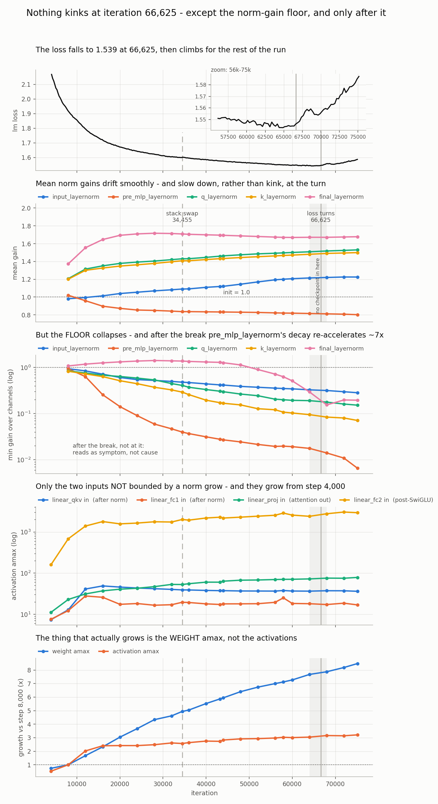
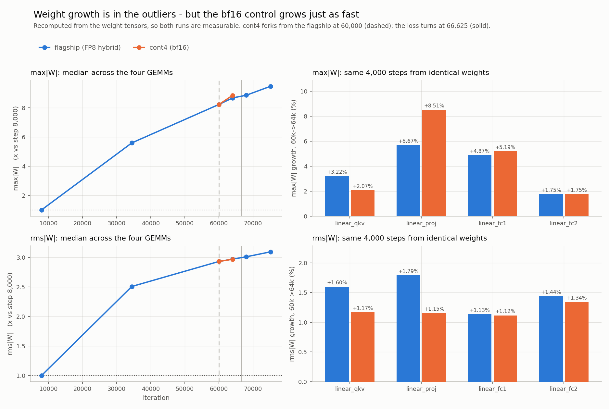

# The 32B flagship loss is going UP

**Status:** not fixed. Run is stopped.
**FP8: CLOSED as the trigger — see [is-it-fp8.md](is-it-fp8.md).** The bf16 control
turns up at 66,625 too; FP8 roughly doubles the rate of decay but does not cause it.
**Software stack: CLOSED as a cause — see §2.** Masking is the open half of the swap.
**Open question:** what turns the loss at 66,625 in *both* number formats. The data
stream is the leading suspect, since it is what the two runs still share.
**Last updated:** 2026-09-02

Everything in this directory is self-contained: the three figures next to this
file, and the CSVs they are drawn from under `data/`. The scanners and plot
scripts that produce them live in `scripts/` and are run from the repository root.
The CSVs are committed because they come from checkpoints on `/e/scratch`,
which is purge-eligible — once those are gone the figures cannot be rebuilt.

> ⚠️ **All wandb runs are OFFLINE.** The flagship log alone has 4,096 "Running in
> WANDB offline mode" lines. Runs live on disk as
> `<run-dir>/wandb/offline-run-<timestamp>-<id>/`. **The links below only resolve
> after somebody runs `scripts/sync_runs.py`** — `wandb sync` keeps the run id, so
> the URLs are already correct. Entity `openeurollm-project`; project
> `oellm_32b_dense` for training, `oellm_32b_dense_probe` for evals.
>
> ✅ **You do not need wandb to check any number in this document.** Every run
> writes plain slurm logs, and they are all here:
>
> ```
> /e/project1/e-sta-openeurollm/production_training/<run-name>/logs/slurm-<jobid>.log
> ```
>
> Note **`/e/project1`**, not `/e/scratch`. `/e/scratch/.../production_training/`
> holds only the *checkpoints*; the logs, configs and wandb dirs are on
> `/e/project1`. Looking in the wrong one makes the evidence look like it does not
> exist. The two lines worth knowing:
>
> - eval score → `grep "lm loss value" <run>/logs/*.log`
> - training loss / grad norm → `grep "lm loss:" <run>/logs/*.log`
>
> The config each job actually ran with is frozen next to it as
> `<run>/logs/config-<jobid>.yaml` — that is how you check what a probe *really*
> had switched on, rather than trusting the run's name.

---

## 1. What is broken

The training loss was going down like it should. Then around **iteration 65,000**
it turned around and started going **up**, and it keeps getting worse.

- Run: `oellm_32b_dense_prod_dataopt5_gbs4096_lr3e-4`
- Last job: `1537344` →
  [wandb](https://wandb.ai/openeurollm-project/oellm_32b_dense/runs/tjeg54n7),
  stopped 2026-08-30 22:43 at iteration **75,125**
- Training loss: **1.5434** at ~65,000 → **1.587** at 75,125

This is not a wobble. It is a steady climb that is speeding up — all of it visible
in job `1537344`
([wandb](https://wandb.ai/openeurollm-project/oellm_32b_dense/runs/tjeg54n7), which
covers 66,626 → 75,125, that is the whole broken stretch):

| iterations | loss change per 1000 steps | where to see it |
|---|---|---|
| 50k–56k | −0.0018 (good, going down) | job `1530865` |
| 62k–66.6k | −0.0005 (nearly stopped) | jobs `1535676`, `1536694` |
| 66.6k–71k | **+0.0023** (going up) | [`1537344`](https://wandb.ai/openeurollm-project/oellm_32b_dense/runs/tjeg54n7) |
| 71k–75k | **+0.0062** (going up faster) | [`1537344`](https://wandb.ai/openeurollm-project/oellm_32b_dense/runs/tjeg54n7) |

**Why this is a big deal:** we are only **8.4% into a 15T-token run**
(75,125 of 894,000 iterations, ~1.26T tokens). If the model gets worse the longer
we train, the other 92% cannot be run this way. Rough cost so far: ~11,000
iterations spent making it worse ≈ **185B tokens ≈ 27,500 GPU-h**.

### How we found the exact spot

Fitting the healthy part of the curve (12k–34k) and extrapolating, the run stays
on track until ~66,000 and then breaks away: +0.012 at 68k, +0.024 at 72k,
+0.038 at 74k. The break is at **~66,625**.

Held-out scores confirm the model really got worse (lower = better):

| checkpoint | score | job | wandb |
|---|---|---|---|
| 60,000 | 1.500890 | `1548575` | [4nlzb9z3](https://wandb.ai/openeurollm-project/oellm_32b_dense_probe/runs/4nlzb9z3) |
| **64,000** | **1.495481** ← best | `1573075` | [n73hfjsd](https://wandb.ai/openeurollm-project/oellm_32b_dense_probe/runs/n73hfjsd) |
| 68,000 | 1.511213 | `1563495` | [qbovy64e](https://wandb.ai/openeurollm-project/oellm_32b_dense_probe/runs/qbovy64e) |
| 72,000 | 1.519173 | `1543640` | [bdinzdw8](https://wandb.ai/openeurollm-project/oellm_32b_dense_probe/runs/bdinzdw8) |

Normally later = better. Here it flips after 64,000. **That flip is the bug.**

---

*Plots of the norm-gain and activation evidence below: see [§7](#7-one-picture).*

## 2. What we tried

### By Thomas

- [x] **Is it a config change?** No. Config is byte-identical (md5) across the
      last 9 jobs, since `1524558`. *(no wandb needed — file comparison)*
- [x] **Is it the learning rate schedule?** No. WSD stable phase, constant 3e-4.
      Decay does not start until sample 3,295,641,600 (~iteration 804,600).
      Visible as a flat `learning_rate` in
      [`1537344`](https://wandb.ai/openeurollm-project/oellm_32b_dense/runs/tjeg54n7).
- [x] **Is it a restart artefact?** No. Measured the loss step at all 12 resumes;
      no pattern. Optimizer + RNG restored every time.
- [x] **Is it harder data?** No. Batch-to-batch noise is flat (0.0049 → 0.0053) in
      [`1537344`](https://wandb.ai/openeurollm-project/oellm_32b_dense/runs/tjeg54n7).
- [x] **Is the loss number itself lying?** **No — and this was the important one.**
      Everything measured so far went through an FP8 forward pass. Re-scored two
      checkpoints with `fp8: null` (bf16):

      | forward pass | 64,000 | 72,000 | gap |
      |---|---|---|---|
      | FP8 | 1.495481 | 1.519173 | +0.023692 |
      | bf16 | **1.494178** | **1.517163** | **+0.022985** |

      jobs `1564918` @64k → [cyw7md2r](https://wandb.ai/openeurollm-project/oellm_32b_dense_probe/runs/cyw7md2r)
      and `1564919` @72k → [63y7kx56](https://wandb.ai/openeurollm-project/oellm_32b_dense_probe/runs/63y7kx56).
      Config `config/experiments/oellm_32b_dense/numerics_probe_bf16_bracket_n32.yaml`.

      **97% of the damage survives** → the weights are genuinely worse. Only 3%
      was FP8 mis-reading them.

- [x] **Is it the RMSNorm gains drifting (missing `zero_centered_gamma`)?** **No.**
      Suggested on the grounds that Qwen3 needs zero-centered gamma for long-run
      stability. Two independent reasons it is not this:

      **1. The flag would be a no-op here.** `zero_centered_gamma` only changes
      `y = γ·x̂` into `y = (1+γ)·x̂` with γ initialised at 0
      ([batch_invariant_kernels.py:998](../../submodules/Megatron-LM/megatron/core/transformer/custom_layers/batch_invariant_kernels.py)).
      `dL/dγ = x̂` either way and Adam sees only gradients, so with **no weight
      decay on the gains** — which is our case, `apply_wd_to_qk_layernorm: false`
      and both `wd_mult`s at 0.0, hitting
      [optimizer/__init__.py:140-144](../../submodules/Megatron-LM/megatron/core/optimizer/__init__.py)
      — the two runs are identical at every step (`γ_zc(t) ≡ γ_std(t) − 1`).
      It cannot slow drift; it only relabels it.
      Also: HF `Qwen3RMSNorm` is the standard Llama one. Our own bridge templates
      agree — all ten set `layernorm_zero_centered_gamma: false`, for example
      [Qwen3-32B/run_config.yaml:277](../../oellm_autoexp/postprocess/resources/megatron_bridge/templates/Qwen/Qwen3-32B/run_config.yaml).
      (Gemma is the arch that uses `(1+γ)`.)
      ⚠️ It could not be flipped mid-run anyway: nothing rewrites checkpoint norm
      weights, so loading our γ≈1 tensors with the flag on gives effective γ≈2.

      **2. Measured it. The gains drift, but not at the break.** Read straight out
      of 21 flagship checkpoints with `scripts/scan_norm_gains.py` — no training,
      no GPU, minutes on the login node. Layer-averaged gain (init = 1.0):

      | iter | linear_qkv | linear_fc1 | q_norm | k_norm | final_norm |
      |---|---|---|---|---|---|
      | 8,000 | 0.9846 | 1.0119 | 1.2056 | 1.1989 | 1.3733 |
      | 24,000 | 1.0415 | 0.8624 | 1.3735 | 1.3524 | 1.7097 |
      | 40,000 | 1.0940 | 0.8201 | 1.4262 | 1.3986 | 1.6996 |
      | 60,000 | 1.1631 | 0.8003 | 1.4764 | 1.4429 | 1.6697 |
      | 64,000 | 1.1748 | 0.7977 | 1.4846 | 1.4501 | 1.6715 |
      | 68,000 | 1.1850 | 0.7958 | 1.4930 | 1.4576 | 1.6714 |
      | 75,126 | 1.1972 | 0.7912 | 1.5000 | 1.4640 | 1.6778 |

      Mean |drift| per 1000 steps — it **decelerates monotonically through the
      break**, and the segment containing 66,625 looks like the one before it:

      | segment | linear_qkv | q_norm | k_norm | linear_fc1 |
      |---|---|---|---|---|
      | 36–60k (healthy) | 0.00501 | 0.00257 | 0.00227 | 0.00130 |
      | 64–68k (**contains the break**) | 0.00414 | 0.00209 | 0.00187 | 0.00074 |
      | 72–75k (broken) | 0.00292 | 0.00109 | 0.00109 | 0.00096 |

      Per layer, only **2/64** q- and k-norms accelerate after the break
      (linear_fc1 26/64, linear_qkv 10/64) — nothing concentrated. Drift was
      *fastest* over 12k–34k, when the loss was falling best.
      ⚠️ Do not quote a "worst layer" version of this: picking the
      max-accelerating layer per tensor shows rates doubling, but that is
      selection bias — the population decelerates.

      **Three things worth keeping from it:**
      - RMSNorm output RMS *is* the gain RMS (the input is normalised to unit
        RMS), so the norm outputs grew only ~9% from 40k→72k while `scale_fwd`
        implies ~73% activation growth. **The growth is not in the norm outputs.**
        It is in the tensors that are not norm-bounded — `linear_proj` input
        (attention output) and `linear_fc2` input (post-SwiGLU). Point any
        activation-RMS probe there first.
      - `final_layernorm` has one channel at **6.31** against a mean of 1.68 (a
        massive-activation / attention-sink channel; grew 1.8 → 6.0 by 48k then
        plateaued). No knee, but it multiplies the LM head input directly and the
        262k output head is untied.
      - ⚠️ **The "no knee" verdict above is about means only.** The *floor* does
        knee. `pre_mlp_layernorm`'s median-over-layers min channel falls
        0.9375 → 0.0066 across the run, and its log-decay rate re-accelerates
        from −0.025/1k (healthy middle) to −0.161/1k over 72k–75k, ~7×, starting
        in the 64k–68k segment. Within-tensor range goes 1.1× → 134×; layers with
        a sub-0.05 channel go 0/64 at 34k to 5/64 at 75k. It steepens *after* the
        turn, so symptom is at least as likely as cause — but the mean-based
        argument does not cover it, and the max is flat at ~0.93 the whole run,
        which is precisely why the mean looked calm. Panel 3 of §7 plots it.

      **The generalisable point:** a quantity that drifts *smoothly* cannot
      produce a knee. To break a run at a specific iteration, a drift needs a
      **threshold** to cross. Gain growth has none. FP8 does — E4M3's 448 is a
      hard limit and the margin is being eaten. That asymmetry is why FP8 stays
      the leading hypothesis and why `cont4` is the right test.
- [x] **Are the activations growing, and does it start at the stack swap?**
      **Growing yes, but not the activations you would expect — and no, it does
      not start at the swap.** Read TE's `amax_history_fwd` / `scale_fwd` out of
      every checkpoint with `scripts/scan_fp8_amax.py` (4,000 → 75,126).
      Median activation amax per FP8 GEMM input:

      | iter | fc1 in | fc2 in | proj in | qkv in |
      |---|---|---|---|---|
      | 4,000 | 7.6 | 168 | 11.7 | 7.4 |
      | 16,000 | 26.3 | 1824 | 37.3 | 48.9 |
      | **34,454** (last pre-swap) | 19.7 | 2016 | 52.8 | 39.2 |
      | **36,000** (first post-swap) | 19.9 | 1936 | 56.3 | 39.3 |
      | 64,000 | 18.4 | 2448 | 72.5 | 36.6 |
      | 75,126 | 17.4 | 2976 | 80.5 | 36.5 |

      Only the two **non-norm-bounded** inputs grow — `linear_proj` (attention
      out) and `linear_fc2` (post-SwiGLU). The norm-bounded ones do not:
      `linear_qkv` peaks at 49 near 16k and *decays*, `linear_fc1` is flat.
      That matches the norm-gain result above: growth is downstream of the norms.

      **No onset, and no coincidence with the swap.** Both are already climbing
      at iteration 4,000, the earliest checkpoint we have. Log-slope, %/10k steps:

      | module | pre-swap 12k–34.4k | post-swap 36k–75.1k |
      |---|---|---|
      | linear_fc2 | 10.66% | 9.75% |
      | linear_proj | **22.89%** | **7.87%** |
      | linear_qkv | −5.75% | −1.05% |
      | linear_fc1 | −18.70% | −0.46% |

      fc2 is unchanged across the swap; linear_proj growth **slowed 3×** after it.
      The swap neither started nor accelerated activation growth.

      **⚠️ The 1.7× in the audit above looks like weights, not activations.**
      My median `scale_fwd` is **9.8 at 40,000 and 9.7 at 72,000 — flat**. But
      the weight column tracks the audit's shape and magnitude:

      | iter | median amax_wgt | 448/amax_wgt | median amax_act | 448/amax_act |
      |---|---|---|---|---|
      | 40,000 | 0.522 | **859** | 45.9 | 9.8 |
      | 72,000 | 0.748 | **599** | 46.0 | 9.7 |

      Weight amax grows 0.070 → 0.777 across the run (11×), monotonic from
      iteration 4,000, no feature at the swap or the break. This matters because
      it **breaks the §4 mechanism**: the margin-erosion argument needs a tensor
      whose amax outruns a scale up to 1024 steps stale. Weight amax moves
      ~1.5%/10k steps late in training — ~0.15% of staleness over 1024 steps,
      negligible, and delayed scaling is *safer* on weights for exactly that
      reason. The tensor where staleness would bite is flat.
      Not yet reconciled against `inspect_fp8_amax.py` (still unpushed), so the
      difference may be in the reduction rather than the conclusion.

      **Nothing knees at 66,625 either.** Re-ran on the `cont2` ladder for
      125-step resolution across the break:

      | iter | fc1 in | fc2 in | proj in | qkv in |
      |---|---|---|---|---|
      | 64,000 | 18.40 | 2448 | 72.5 | 36.56 |
      | 65,000 | 20.62 | 2896 | 73.5 | 37.41 |
      | 65,500 | 18.41 | 2848 | 73.5 | 36.00 |
      | 65,625 | 18.07 | 2912 | 75.0 | 36.28 |
      | 66,000 | 17.75 | 3024 | 75.5 | 36.25 |
      | 66,500 | 17.86 | 2816 | 75.5 | 37.39 |

      fc2 just oscillates 2816–3024, fc1 and qkv drift down, `scale_fwd` sits at
      9.7–9.9 throughout. ⚠️ A coarse 4,000-step fit made fc2 look like it
      accelerated at the break (9.6% → 19.3%/10k); that was noise and does **not**
      survive this resolution — do not quote it.

      **Net:** cont4 pulling ahead in bf16 is still real evidence that FP8 is
      implicated, but not by the §4 route. If FP8 is the cause, the mechanism is
      something other than activations eating the E4M3 margin.
      NB the scan needs a GPU node for post-34,455 checkpoints (they pickle TE
      objects that need TE importable, hence libcuda); older ones run on login.

- [x] **Did the FP8 scale state break at the swap, or at 66,625?** **No to both.**
  Scanned the TE `_extra_state` in all 22 surviving checkpoints (4,000 → 75,126)
  with `scripts/scan_fp8_amax.py` → `docs/fp8-loss-turn/data/fp8_amax.csv`.

  | check | result |
  |---|---|
  | 34,454 → 36,000 (the swap) | continuous on all 4 FP8 GEMMs; growth ratio post/pre **0.95–0.98** |
  | 64,000 and 68,000 (the break) | on trend; no spike, no non-finite |
  | median `scale_fwd`, 16,000 → 75,126 | **flat at ~9.8** |

  So the force-unpickled amax history came through TE 2.14 → 2.18 **intact**, and
  the FP8 bookkeeping shows **no feature at the break**. This measures the scaling
  bookkeeping, not FP8 rounding error in the weights — FP8-in-training is still live.

  Runs on a login node: put a stub `libcuda.so.1` on `LD_LIBRARY_PATH` (TE dlopens
  it `RTLD_LAZY` and nothing calls CUDA). No GPU, ~8 min.

### By Korbinian

- [x] **Is it the software stack (forward)?** **No — re-verified from the raw logs
      2026-09-02, exact to every printed digit.**

      The idea: take **one** checkpoint, so the weights cannot differ, and score it
      under three different software stacks. If a container or a kernel were
      computing something wrong, the three numbers would disagree.

      | arm | container | TE | `attention_backend` | job | `lm loss value` |
      |---|---|---|---|---|---|
      | te218+FA3 | `MegatronTraining-JUPITER-te218-fa3` | 2.18.0 | `flash` | `1543640` | **1.519173E+00** |
      | te218+cuDNN | same | 2.18.0 | `auto` | `1548568` | **1.519173E+00** |
      | nemo26.04+cuDNN | `nemo_26.04.sif` | 2.14.0+71bbefbf | `auto` | `1548574` | **1.519173E+00** |

      The container paths and TE banner lines were read back out of the logs, so
      these really are three different stacks and not the same one run three times.
      Reproduce:

      ```
      cd /e/project1/e-sta-openeurollm/production_training
      grep -h "lm loss value" oellm_32b_dense_stackprobe-{te218-fa3,te218-cudnn,nemo2604-cudnn}-i72k_gbs4096_lr3e-4/logs/*.log
      grep -h "Transformer Engine version" oellm_32b_dense_stackprobe-*-i72k_*/logs/*.log
      ```

      (The 60k arm, `1548575`, is in the same place under `...-te218-fa3-i60k_...`
      and reads **1.500890E+00**.) Config `stack_numerics_probe_n32.yaml` is still
      not pushed, but the frozen copy each job ran is at
      `<run>/logs/config-<jobid>.yaml`, which is better evidence anyway.
- [x] **Is it the software stack (gradients)?** **No — re-verified from the raw logs
      2026-09-02.**

      The forward probe only proves the two stacks *read* the weights the same way.
      This one proves they *train* the same way: same config, same seed, 2 steps
      from scratch, only the container swapped.

      | arm | job | it 1 loss / grad norm | it 2 loss / grad norm |
      |---|---|---|---|
      | TE 2.14, PP=1 | `1574335` | 1.349407E+01 / 9.749 | 1.349360E+01 / 10.055 |
      | TE 2.18, PP=1 | `1574334` | 1.349407E+01 / 9.749 | 1.349360E+01 / 10.055 |
      | TE 2.14, PP=4 | `1574662` | 1.351830E+01 / 14.266 | 1.351815E+01 / 14.795 |
      | TE 2.18, PP=4 | `1574661` | 1.351830E+01 / 14.266 | 1.351815E+01 / 14.795 |

      (PP=4+VPP=4, job `1574828`, is a te218-only arm at 1.350957E+01 / 14.346 —
      a different parallel layout, so it is not a pair with anything.) Reproduce:

      ```
      cd /e/project1/e-sta-openeurollm/production_training
      grep -h "lm loss:" oellm_32b_dense_attnprobe-bf16-te21{4,8}_gbs4096_lr3e-4/logs/*.log
      ```

      ⚠️ **Two honest limits on this probe** — both read out of
      `<run>/logs/config-1574334.yaml`:
      1. It says **identical to printed precision** (6 significant figures on the
         loss, 3 decimals on the grad norm), not literally *bit*-identical. Same
         conclusion, more accurate wording.
      2. It ran **`fp8: null`**, that is in bf16. So it compares TE 2.14 vs 2.18 in
         bf16, and production trains in FP8. The FP8 *gradient* path across the TE
         upgrade is the one arithmetic corner nobody has measured. Cheap to close:
         rerun these same two arms with production's `fp8` block switched on.
         Also note it is 2 steps at lr 3e-8 — that tests whether the kernels agree,
         not whether anything drifts apart over 30,000 steps.
      Both arms had `dataloader_inter_document_masking: true`, so the probe holds
      the objective fixed on purpose. That is correct design, and it is exactly
      why it says nothing about masking.
- [x] **Is it the software stack SWAP we did mid-run?** **The software half is
  CLOSED (2026-09-02). The objective change it carried is not — that moves to its
  own open item below.**

  We replaced the container, Transformer Engine, megatron-core and the attention
  backend **in the middle of the run**, on 2026-08-28 at **iteration 34,455**.
  Job `1524558` ([eef62uvs](https://wandb.ai/openeurollm-project/oellm_32b_dense/runs/eef62uvs))
  is the first on the new stack; `1516079`
  ([uaewx25r](https://wandb.ai/openeurollm-project/oellm_32b_dense/runs/uaewx25r))
  ran to 34,450 on the old one — **overlay those two to see the boundary.**

  | | before (`1516079`) | after (`1524558`) |
  |---|---|---|
  | container | `nemo_26.04.sif` | `MegatronTraining-JUPITER-te218-fa3` |
  | Transformer Engine | 2.14 | 2.18 |
  | megatron-core | 0.16 | 0.19 |
  | `attention_backend` | `auto` (cuDNN) | `flash` (FA3) |
  | `dataloader_inter_document_masking` | *did not exist* | **`true`** |
  | `data_parallel_sharding_strategy` | `no_shard` | `optim_grads_params` |

  Commits, all 2026-08-28: `cfe21f8` *Adopt document masking, FlashAttention 3 and
  the te218-fa3 container* · `a27f103` *Update Megatron-LM to 0.19* · `521a12d` /
  `bcb0797` *TE 2.18 container* · `390ee3c` *configs and scripts that validated the
  0.19 switch*

  The point of the swap was to make inter-document masking actually work. Per
  `CROSS_DOC_ATTENTION.md` the three old masking flags were **inert** on the old
  stack, so everything before 34,455 trained with full cross-document attention and
  everything after trains with real per-document masking.

  ✅ **CLOSED: the software does not compute anything wrong.** Four independent
  lines, all now checked against raw logs or local CSVs rather than quoted:

  | evidence | what it shows | where |
  |---|---|---|
  | forward probe, 3 stacks @72k | **1.519173E+00** three times | checkbox above |
  | gradient probe, TE 2.14 vs 2.18 | identical loss *and* grad norm, PP=1 and PP=4 | checkbox above |
  | FP8 amax/scale state across 34,455 | continuous, no jump | table below |
  | **loss trajectory across 34,455** | **no change in slope** | new, below |

  **The trajectory test, and why it is the one that actually settles it.**
  An event can hit a loss curve in two very different ways, and they mean opposite
  things:

  - **a level shift** — the curve jumps once, then keeps falling at the same angle.
    That is a changed *measurement or task*, like swapping to a scale that reads
    200 g heavy. Nothing is wrong with the run.
  - **a slope change** — the curve stops falling and starts rising. The *learning*
    is broken.

  Fitting both at once (level step + slope change, ±6,000 iterations either side,
  ~2,400 points per fit, from `docs/fp8-loss-turn/data/loss.csv`):

  | breakpoint | level step | slope change | slope before → after |
  |---|---|---|---|
  | **34,455** (the swap) | +0.00365 ± 0.00042 (**8.7σ**) | +0.00016 ± 0.00012 /1k (**1.3σ — none**) | −0.00326 → −0.00310 /1k |
  | **66,625** (the turn) | +0.00540 ± 0.00043 (12.7σ) | **+0.00345 ± 0.00012 /1k (28σ)** | −0.00050 → **+0.00295** /1k |

  Read it as: **the swap bumped the curve and left it descending at the same rate.
  The turn, 32,000 steps later, changed the rate.** Those are different kinds of
  event, and only the second one is the bug. Same story in the grad norm — it steps
  +0.024 at the swap and +0.004 at the turn, that is the *swap* is the one that looks
  like a changed task.

  Reproduce (login node, seconds, no GPU): `loss.csv` comes from
  `python3 scripts/extract_loss.py <run_dir>/logs --csv docs/fp8-loss-turn/data/loss.csv`; the fit is an ordinary
  least-squares regression of `lm_loss` on `[1, x, d, d·x]` where `x` is
  (iteration − breakpoint)/1000 and `d` is 1 after the breakpoint.

  ⚠️ **What "closed" does and does not mean.** Closed = container, TE version,
  megatron-core and attention kernel do not corrupt numbers, and the swap did not
  bend the learning curve. **Not** closed = the FP8 gradient path across TE 2.14 →
  2.18, which the gradient probe skipped by running in bf16 (see its ⚠️ above).
  That is a small, cheap gap, not a live suspect.

  ❌ **The objective change rides along and is NOT closed.** The +0.00365 level
  step is precisely the objective change becoming visible: masking on changes
  *what the model is trained on* — per-document attention, RoPE restarting per
  document, and `per_sequence_balancing` loss normalisation
  ([pretrain_gpt.py:128,173](../../submodules/Megatron-LM/pretrain_gpt.py)). Note
  the logic here: the numerics probes prove that step is **not** arithmetic, which
  leaves the objective as the only thing it can be. **No probe of that shape can
  see it**, because every arm deliberately evaluates the *same* objective. Tracked
  as its own item — *"Is it the masking?"*, below.

  **Timing still argues against masking being the direct cause:** the swap was at
  34,455 and the loss kept improving normally for ~**32,000 more iterations**
  before turning at 66,625. A broken objective usually hurts immediately. That does
  not rule out a slow cumulative effect, but it ranks below FP8.

  ⚠️ **Side effect:** loss numbers before and after 34,455 are not strictly
  comparable, because the objective changed. The +0.00365 is the size of that
  offset — subtract it before comparing across the boundary.

- [x] **Where does the damage start?** "Ladder" — 6 checkpoints scored:
      flagship 64k `1573075` → [n73hfjsd](https://wandb.ai/openeurollm-project/oellm_32b_dense_probe/runs/n73hfjsd) ·
      flagship 68k `1563495` → [qbovy64e](https://wandb.ai/openeurollm-project/oellm_32b_dense_probe/runs/qbovy64e) ·
      cont2 65,000 `1563497` → [cqcarvfh](https://wandb.ai/openeurollm-project/oellm_32b_dense_probe/runs/cqcarvfh) ·
      65,500 `1563500` → [0hxqfqu8](https://wandb.ai/openeurollm-project/oellm_32b_dense_probe/runs/0hxqfqu8) ·
      65,625 `1563502` → [0jmlocsy](https://wandb.ai/openeurollm-project/oellm_32b_dense_probe/runs/0jmlocsy) ·
      66,000 `1563494` → [toq5cc6t](https://wandb.ai/openeurollm-project/oellm_32b_dense_probe/runs/toq5cc6t)
- [x] **Is it the data order?** No. `cont2` re-shuffled with seed 4321 and got
      worse anyway (+0.0032 held-out by 66,000). Job `1558724` →
      [921bmgjb](https://wandb.ai/openeurollm-project/oellm_32b_dense/runs/921bmgjb)
- [x] **Is it the machines?** No. Same run
      [`921bmgjb`](https://wandb.ai/openeurollm-project/oellm_32b_dense/runs/921bmgjb)
      ran on 468 of 512 *different* nodes and still degraded.
- [x] **Is it weight decay?** No. Weight RMS *rises* 0.016688 → 0.017121, so decay
      is not dominating.
- [x] **Is it the FP8 bookkeeping?** No — but it found the smoking gun. Offline
      audit (`scripts/korbi/inspect_fp8_amax.py`, *not pushed*): no non-finite
      values, `scale == fp8_max/amax` exact. **But** median `scale_fwd` fell
      **610 → 464 → 410 → 382 → 352** between iterations 40,000 and 72,000 —
      forward activations grew **~1.7×**. *(offline script on checkpoints, no
      wandb run)*
      **Superseded** — the full-history scan above finds `scale_fwd` flat and no
      kink. Within one module `scale_fwd` spans **1 → 409.6** across its 3 columns,
      so median- and max-within-entry differ ~40×: the two are different statistics.
      ⚠️ **Disputed — see the amax re-scan below. The tensor that grows 1.4× over
      that window is the WEIGHT amax, not the activation amax.**
- [ ] **Is it the masking?** **OPEN, and now the only surviving half of the swap.**
      Everything else the swap carried is closed above, so this inherits the whole
      question. Still ranked below FP8 on timing (32,000 good steps after it was
      switched on), but nothing is currently testing it, whereas `cont4` is testing
      FP8.

      `cont3` (job `1563277` →
      [59cgca5p](https://wandb.ai/openeurollm-project/oellm_32b_dense/runs/59cgca5p),
      config `oellm_32b_dense_cont3_oldsettings.yaml`) reverts the *whole* old
      stack at once (nemo26.04 + TE 2.14 + no masking + cuDNN), so it cannot
      isolate masking, and it only ran 65,500 → 66,640.

      ⚠️ **But "no held-out scores" is now just an unrun eval, not missing data.**
      The checkpoints are on disk:
      `/e/scratch/e-sta-openeurollm/production_training/oellm_32b_dense_prod_dataopt5_cont3_nomask_seed4321/`
      → `checkpoints/iter_0065500`, `checkpoints/iter_0066645`,
      `checkpoints_rolling/iter_0066625`. Scoring 66,645 against flagship 66,000
      costs almost nothing and at least says whether the no-mask arm was tracking
      better at the turn. It still will not *isolate* masking — cont3 changed four
      things — so treat it as a cheap smoke test, not the experiment.

      **The actual experiment is a mirror of `cont4`:** fork from 60,000 with
      `dataloader_inter_document_masking: false`, FP8 **on**, everything else at
      current production. cont4 asks "does turning FP8 off prevent it?"; this asks
      "does turning masking off prevent it?". Only one variable each.
- [ ] **Is it FP8?** **In progress.** `cont4` (job `1580164` →
      [yejlm5uz](https://wandb.ai/openeurollm-project/oellm_32b_dense/runs/yejlm5uz),
      config `oellm_32b_dense_cont4_bf16_from60k.yaml`) forks at 60,000 and
      trains in **bf16**. It is winning and pulling away:

      | iterations | flagship (FP8) | cont4 (bf16) | gap |
      |---|---|---|---|
      | 60,000–60,500 | 1.5476 | 1.5442 | −0.0033 |
      | 62,500–63,000 | 1.5465 | 1.5424 | −0.0040 |
      | 63,000–63,500 | 1.5457 | 1.5402 | **−0.0055** |

      Overlay [yejlm5uz](https://wandb.ai/openeurollm-project/oellm_32b_dense/runs/yejlm5uz)
      against [tjeg54n7](https://wandb.ai/openeurollm-project/oellm_32b_dense/runs/tjeg54n7)
      to see it. **But it stopped at 63,220** — 3,405 iterations *short* of the
      break — so it has not yet been through the danger zone.
- [ ] **`cont5`** (bf16 from 64,000) — **crashed 3× with zero steps**: jobs
      `1565209`, `1565895`, `1566470` →
      [u0ym9e9h](https://wandb.ai/openeurollm-project/oellm_32b_dense/runs/u0ym9e9h)
      (nothing logged; read the slurm log for the traceback).

---

## 3. Two things that wasted time (do not repeat)

1. **`log_max_attention_logit: true`** killed ~8 consecutive 512-node starts
   (~700 GPU-h). It looks like "just logging" but it makes TE disable every fused
   attention kernel, leaving only the unfused path → OOM, or
   `ValueError: No dot product attention backend is available` when
   `attention_backend: flash` is pinned. It lived only in the bf16 forks, so
   "bf16" and "the flag" looked like the same thing. **Keep it off.**
   Dead jobs: `1565251`, `1566161`, `1567010`, `1573069`, `1573297`, `1573378`,
   `1574997`, `1575141`, `1576287` (cont4) and `1565209`, `1565895`, `1566470`
   (cont5).
2. **`attention_backend: flash` does not work in bf16** with document masking
   (thd/cu_seqlens). Use `auto` → cuDNN. Costs nothing scientifically: FA3 and
   cuDNN measured identical to 6 decimals
   ([bdinzdw8](https://wandb.ai/openeurollm-project/oellm_32b_dense_probe/runs/bdinzdw8)
   vs [haao7dqu](https://wandb.ai/openeurollm-project/oellm_32b_dense_probe/runs/haao7dqu)).

---

## 4. Current hypothesis

**FP8 training is slowly damaging the weights.**

⚠️ **The premise of this paragraph is disputed** — the checkpoint re-scan in §2
finds activation amax *flat* from 16,000 onward, with the 1.4–1.7× growth sitting
in the weight amax instead. Treat what follows as the hypothesis as originally
written, pending reconciliation.

Forward activations do grow (`linear_proj` amax 52.8 → 80.5 from the swap to
75,126), but the full-history scan shows the recipe **tracking it**: median
`scale_fwd` is flat at ~9.8, and with `fp8_amax_compute_algo: max` growth is the
*safe* direction. So the margin is **not** being eaten — that mechanism is dead.
What is left is plain accumulated FP8 rounding error, which accumulates instead of spiking,
which is why every metric we log looks fine: grad norm actually *falls*
(0.512 → 0.457) across the turn, clip never binds, zero NaN, zero skipped steps —
all checkable in
[tjeg54n7](https://wandb.ai/openeurollm-project/oellm_32b_dense/runs/tjeg54n7).

Making it worse: production runs `first_last_layers_bf16: **false**`, so *every*
layer is FP8 including the logit-adjacent one (262k vocab, untied output
weights). The repository's own `precision/fp8.yaml` sets that to `true` and calls it
"meaningful insurance". Production also runs the `delayed` recipe, which HEAD
labels **UNVERIFIED**, instead of `tensorwise`, labelled **VERIFIED WORKING**.

**Still not fully ruled out:** the learning rate (low prior — grad norm falls and
there are no spikes, which is the opposite of LR-too-high) and document masking
(never isolated; `cont3` bundled it with everything else).

**Closed as of 2026-09-02:** the software stack. Forward, backward, FP8 scale
state, and the loss trajectory across the swap all agree — see §2. The single
remaining arithmetic gap is the **FP8** gradient path across TE 2.14 → 2.18,
because the gradient probe ran in bf16; small, cheap, not a live suspect.

---

## 5. Plan

### Now
1. **Restart `cont4`**
   ([yejlm5uz](https://wandb.ai/openeurollm-project/oellm_32b_dense/runs/yejlm5uz)).
   It died to an NCCL watchdog hang (infrastructure, not numerics) with nothing
   watching. It resumes from its own bf16 checkpoint
   `checkpoints_rolling/iter_0063125` and now stops at **68,000**
   (`exit_interval: 68000`), which is past the break and lands on a save
   boundary. ~4,875 steps, one 8h22m segment, 17,152 GPU-h.
   - ⚠️ **Start the monitor first.** The seed→train gate needs it, and last time
     nothing was watching (newest monitor state 08-31 22:53, job started 23:02).
   - ⚠️ `checkpoints_rolling/iter_0063125` is the **only** copy of iterations
     60,369–63,220. Do not prune it. This is why `/job` is now `auto_cancel`
     (no `QuarantineCheckpointAction`, which renames checkpoints it fails to load).
   - ⚠️ Keep `chain_repeat: 1`. `exit_interval` is a modulo test, so a second
     segment would resume at 68,000 and run to **136,000**.

2. **Then run `cont5`** (bf16 from 64,000) — already fixed in the repository, never run.
   Different question: cont4 asks *"does bf16 prevent it?"*, cont5 asks
   *"can we rescue the run from the best checkpoint?"*

### Read-off for cont4
- Curve keeps falling past 66,625 → **FP8 confirmed.**
- Curve turns up on the same schedule as the flagship → **FP8 cleared**, and we
  are back to the learning rate and masking.

Bonus: cont4 saves at **64,000 and 68,000**, and the flagship already has scores
at both ([n73hfjsd](https://wandb.ai/openeurollm-project/oellm_32b_dense_probe/runs/n73hfjsd),
[qbovy64e](https://wandb.ai/openeurollm-project/oellm_32b_dense_probe/runs/qbovy64e)),
so we get two matched comparison points for free.

### After that
3. **Pick the fix**, cheapest first:
   `first_last_layers_bf16: true` → `fp8_recipe: tensorwise` → full bf16.
   Needs one speed/stability measurement at 512 nodes.
4. **Resume the flagship from iteration 64,000** — the best checkpoint measured
   in either precision.
5. **Isolate masking properly** — `cont3` never did.

### Blocked on Korbinian
6. **Push Megatron `7f9b5934`** — the superproject pins it but it was never
   pushed, so `git pull` fails on the submodule and nobody else can use the new
   `diag_*` collectors (per-layer grad norms, norm-gain drift, clip events),
   which are aimed exactly at this failure mode.
7. **Push `scripts/korbi/inspect_fp8_amax.py`** — the amax numbers are the single
   best piece of evidence we have and the script does not exist on the remote.
8. **Run `scripts/sync_runs.py`** — every wandb link in this document is dead
   until the offline runs are pushed. **Downgraded from blocking:** as of
   2026-09-02 every number here has been re-derived from the slurm logs on
   `/e/project1` (see the box at the top), so nobody is stuck waiting on this.
   Still worth doing for the plots.

---

## 6. Run index

Names are deterministic: **`<run-directory-name>_<SLURM_JOB_ID>`**.
URL: `https://wandb.ai/openeurollm-project/<project>/runs/<id>`
Logs: `/e/project1/e-sta-openeurollm/production_training/<run-directory-name>/logs/slurm-<job>.log`

The wandb column only works after `sync_runs.py`. **The logs path always works**,
and `<run>/logs/config-<job>.yaml` next to it is the config that job actually ran
— check that rather than trusting a run's name. Directories behind the stack
verdict, all under `/e/project1/e-sta-openeurollm/production_training/`:

| what | directory | reads |
|---|---|---|
| forward probe, 3 arms @72k | `oellm_32b_dense_stackprobe-{te218-fa3,te218-cudnn,nemo2604-cudnn}-i72k_gbs4096_lr3e-4` | `lm loss value` |
| forward probe @60k | `oellm_32b_dense_stackprobe-te218-fa3-i60k_gbs4096_lr3e-4` | `lm loss value` |
| gradient probe, TE pairs | `oellm_32b_dense_attnprobe-bf16-te21{4,8}_gbs4096_lr3e-4` and the `-pp4` / `-pp4-vpp4` variants | `lm loss:` |
| bf16 re-scores | `oellm_32b_dense_numprobe-bf16-i{64,72}k_gbs4096_lr3e-4` | `lm loss value` |
| ladder | `oellm_32b_dense_ladder-{flagship-i64000,flagship-i68000,cont2-i65000,cont2-i65500,cont2-i65625,cont2-i66000}_gbs4096_lr3e-4` | `lm loss value` |
| flagship (source of `data/loss.csv`) | `oellm_32b_dense_prod_dataopt5_gbs4096_lr3e-4` | `lm loss:` |
| cont2 / cont3 / cont4 / cont4b / cont5 | `oellm_32b_dense_prod_dataopt5_{cont2_seed4321,cont3_nomask_seed4321,cont4_bf16_seed1234,cont4b_bf16_seed1234,cont5_bf16_i64k_seed1234}_gbs4096_lr3e-4` | `lm loss:` |

⚠️ `/e/scratch/.../production_training/` has the **same run names** but contains
only checkpoints — no logs, no configs, no wandb dirs. A run that looks like it
has no evidence is usually a run you are looking for on the wrong file system.
This is what made the stack probes look unverifiable on 2026-09-02; they were
there the whole time.

| run | job | id | project |
|---|---|---|---|
| flagship, old stack (→34,450) | `1516079` | `uaewx25r` | `oellm_32b_dense` |
| flagship, new stack (34,455→) | `1524558` | `eef62uvs` | `oellm_32b_dense` |
| flagship, the broken stretch | `1537344` | `tjeg54n7` | `oellm_32b_dense` |
| cont2 (seed 4321) | `1558724` | `921bmgjb` | `oellm_32b_dense` |
| cont3 (old stack) | `1563277` | `59cgca5p` | `oellm_32b_dense` |
| **cont4 (bf16)** | `1580164` | `yejlm5uz` | `oellm_32b_dense` |
| cont5 (crashed) | `1566470` | `u0ym9e9h` | `oellm_32b_dense` |
| bf16 eval @64k | `1564918` | `cyw7md2r` | `oellm_32b_dense_probe` |
| bf16 eval @72k | `1564919` | `63y7kx56` | `oellm_32b_dense_probe` |
| stack probe FA3 @72k | `1543640` | `bdinzdw8` | `oellm_32b_dense_probe` |
| stack probe cuDNN @72k | `1548568` | `haao7dqu` | `oellm_32b_dense_probe` |
| stack probe nemo26.04 @72k | `1548574` | `h70nuvhz` | `oellm_32b_dense_probe` |
| stack probe FA3 @60k | `1548575` | `4nlzb9z3` | `oellm_32b_dense_probe` |
| ladder flagship 64k | `1573075` | `n73hfjsd` | `oellm_32b_dense_probe` |
| ladder flagship 68k | `1563495` | `qbovy64e` | `oellm_32b_dense_probe` |
| ladder cont2 65,000 | `1563497` | `cqcarvfh` | `oellm_32b_dense_probe` |
| ladder cont2 65,500 | `1563500` | `0hxqfqu8` | `oellm_32b_dense_probe` |
| ladder cont2 65,625 | `1563502` | `0jmlocsy` | `oellm_32b_dense_probe` |
| ladder cont2 66,000 | `1563494` | `toq5cc6t` | `oellm_32b_dense_probe` |

**No wandb run:** the five `attnprobe-*` jobs (`1574335`, `1574334`, `1574662`,
`1574661`, `1574828`) wrote no wandb directory — read their slurm logs at the
path above. This costs nothing: their loss and grad norm are in the logs at full
printed precision, which is what §2 quotes. The FP8 amax audit is an offline
script over checkpoints, not a run.

**Everything else did write one**, offline, as `<run>/wandb/offline-run-*` — for example
the bf16 re-score at 64k is
`oellm_32b_dense_numprobe-bf16-i64k_gbs4096_lr3e-4/wandb/offline-run-20260831_164711-cyw7md2r`,
matching `cyw7md2r` in the table. So the run ids above are checkable on disk
before anyone syncs anything.

---

## 7. One picture



Regenerate with `python3 scripts/plot_drift.py`, run from the repository root
(login node; reads `docs/fp8-loss-turn/data/` — `norm_gains.csv`, `fp8_amax.csv`, `loss.csv`).

**The dashed line is the stack swap (34,455). The solid line is where the loss
turned (66,625). The grey band is 64,000–68,000: there is no checkpoint in it,
so the four checkpoint-derived panels cannot resolve anything at the break
itself — only on either side of it.** The loss panel is logged every step and has
no such blind spot.

- **1 — the loss.** The thing being explained, so the rest of the figure is not
  arguing against a curve you have to take on trust. Flat around 1.539 through
  60k–66k, climbing steadily from ~67k to 1.584 at 75,125. Inset zooms the turn,
  which is 0.045 on a panel spanning 0.6.
- **2 — norm gains, mean.** They do drift away from their init of 1.0, so the
  concern was fair. But every curve is smooth and *flattening*, and the drift was
  fastest over 12k–34k, when the loss was falling best. Nothing changes at 66,625.
  (And `zero_centered_gamma` would not alter any of this — with no weight decay on
  the gains it is the same run with the numbers shifted by 1; see §2.)
- **3 — norm gains, floor.** The one statistic in this figure that *does* move at
  the turn. The mean is held up by a max that never budges (`pre_mlp_layernorm`
  max sits at ~0.93 all run); what actually happens is the smallest channel in
  each tensor collapsing. `pre_mlp_layernorm`'s median-over-layers min goes
  0.9375 → 0.0066, and its log-decay rate, having *decelerated* to −0.025/1k
  through the healthy middle of the run, re-accelerates to −0.161/1k over
  72k–75k — about **7×**. Layers with a sub-0.05 channel go 0/64 at 34k to 5/64
  at 75k. ⚠️ This starts in the 64k–68k segment and steepens *after* it, so it
  reads as a symptom of an already-broken run at least as easily as a cause. Do
  not present it as the trigger. Do treat "which channels, and are they the same
  ones each time" as the obvious next scan.
- **4 — activation amax, per FP8 GEMM input.** The two that grow,
  `linear_proj` (attention out) and `linear_fc2` (post-SwiGLU), are the two *not*
  bounded by a norm. They are already climbing at step 4,000, they do not care
  about the swap, and they do not kink at the turn. The two norm-bounded inputs
  are flat or falling.
- **5 — indexed to step 8,000.** Weight amax grows ~8× over the run;
  activation amax barely moves. This is the one that matters for §4: the
  margin-erosion story needs *activations* outrunning a stale scale, and they are
  the flat line. ⚠️ Two caveats. (a) `amax` is a 1024-step rolling max over
  *single elements*, so 8× describes the most extreme weight in the tensor, not
  the bulk — panel 3's floor collapse is the same kind of extremes story.
  (b) No healthy reference can be plotted *from this source*: both amax curves
  come from TE's delayed-scaling `_extra_state`, and `cont4` runs `fp8: null`,
  so it records no amax history. **§8 controls it a different way** and the
  answer is that this panel is a red herring. Panel 4 has no such escape —
  activations are not in checkpoints, so it is FP8-only.

**How to read it in one sentence:** something that changes smoothly cannot cause a
sudden turn — if the tyres wore down gradually, that does not explain why the car
stopped at mile 200 rather than mile 150. Whatever broke this run has to have a
threshold it crossed at 66,625, and none of the *averages* do.

Caveat, so nobody is over-sold: this rules these two out as the *trigger*. It does
not clear FP8 — `cont4` in bf16 really is pulling ahead of the flagship. It says
that if FP8 is the cause, §4 has the wrong mechanism. And per panel 3, "nothing
kinks" is now only defensible about central tendency: the tails were never
plotted before, and one of them moves.


---

## 8. Is the weight growth actually anomalous? No.



Regenerate with `python3 scripts/plot_weight_control.py`, run from the repository
root (reads `docs/fp8-loss-turn/data/weight_stats.csv`, built by `scripts/scan_weight_stats.py`,
one invocation per checkpoint, concatenated — see that script's header for
the `libcuda.so.1` stub the pre-swap checkpoints need).

§7 panel 5 shows weight amax growing ~8× and invites the reading that something
is wrong with the weights. It is not a finding. Two things were wrong with it:
it is FP8-only, so it had no control, and `amax` is a single-element max, so it
says nothing about the bulk.

Both are fixed by recomputing `max|W|` and `rms|W|` straight off the weight
tensors, which every run has regardless of numerics. `cont4` forks from the
flagship at **60,000** and reaches 64,000, so the comparison is the same 4,000
steps from *bit-identical starting weights* — the only difference is FP8 vs
bf16.

**The fork is a free correctness check.** At 60,000 the two runs must agree
exactly, and they do, on all eight quantities (for example `linear_fc2` max|W| =
1.78906 in both). If the scan were wrong this would not hold.

**Result: bf16 grows the same or faster.**

| tensor | max\|W\| FP8 | max\|W\| bf16 | rms\|W\| FP8 | rms\|W\| bf16 |
|---|---|---|---|---|
| `linear_qkv`  | +3.22% | +2.07% | +1.60% | +1.17% |
| `linear_proj` | +5.67% | **+8.51%** | +1.79% | +1.15% |
| `linear_fc1`  | +4.87% | +5.19% | +1.13% | +1.11% |
| `linear_fc2`  | +1.75% | +1.75% | +1.44% | +1.34% |

Weight growth is not FP8-specific. On `linear_proj` the bf16 control grows
*half again as fast*. **Drop weight growth as evidence for anything.**

The outlier/bulk split does hold — max|W| runs ~9× over the flagship run against
~3× for rms|W|, so growth really is concentrated in extremes — but it holds
equally in bf16, so it is not evidence about this failure either.

⚠️ **What this does not cover.** `cont4`'s last checkpoint is 64,000, which is
*before* the break at 66,625, so this establishes that weight growth is normal
in the run-up, not that it stays normal afterwards. No bf16 run currently has a
checkpoint past 64,000. `cont4b` (job 1620342, forked at 63,125) will produce
one — that is the run to re-scan for the post-break window.
