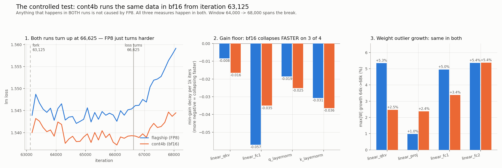

# Is FP8 what broke the 32B run? A controlled test

**Short answer: no — but it makes it about twice as bad.**

**Date:** 2026-09-02 · **Evidence:** Slurm job `1620342` (COMPLETED, 3h01m, exit 0)

This page is written to be readable without having followed the whole
investigation. The technical record is in [README.md](README.md).

---

## 1. The situation

We are training a 32-billion-parameter model. Training loss is supposed to go
*down* forever. Ours went down until **iteration 66,625**, then started going
**up** and never recovered. The run is stopped.

The main suspect was **FP8**. FP8 is a very low-precision number format (8 bits
per number instead of 16). It makes training roughly twice as fast, but each
number is stored coarsely, so the worry is always that the rounding error piles
up until training breaks.

So: did FP8 break it?

## 2. How you answer that question properly

You cannot tell by staring at the FP8 run. Lots of things in a training run
drift, grow, and look alarming, and almost all of them are normal. The only way
to know whether FP8 is responsible is to **run the same thing without FP8 and
see if it still breaks.** That is a *control experiment*.

That is exactly what `cont4b` is:

```
flagship (FP8) ─────────●────────────────────────────►  keeps running in FP8
                        │  iteration 63,125
                        └───────────────────────────►  cont4b: same everything,
                                                        but bf16 instead of FP8
```

`cont4b` starts from the flagship's own saved weights at iteration 63,125 and
continues with the **same data in the same order, the same learning rate, the
same batch size**. The *only* difference is the number format. So:

> **Anything that happens in both runs cannot have been caused by FP8.**

`cont4b` finished on 2026-09-02 and reached iteration 68,000 — past the
breakpoint at 66,625. That is what made this test possible; until then no bf16
run had a checkpoint on the far side of the break.



## 3. What we found

### Result 1 — the loss turns up in bf16 too

Measuring the slope of the loss curve before and after iteration 66,625
(negative = improving, positive = getting worse), per 1,000 iterations:

| run | before 66,625 | after 66,625 |
|---|---|---|
| flagship (FP8) | −0.00036 | **+0.00904** |
| cont4b (bf16) | −0.00073 | **+0.00391** |

Both go from roughly flat to clearly rising. **Turning off FP8 did not prevent
the turn.** It roughly halved how fast things got worse.

You can see the two runs pulling apart in panel 1 of the figure. The gap between
them is flat at +0.0045 for the whole stretch before the break, then grows:

| iteration | 63,000–65,500 | 66,500 | 67,000 | 67,500 | 68,000 |
|---|---|---|---|---|---|
| flagship − cont4b | +0.0045 (flat) | +0.0071 | +0.0093 | +0.0119 | +0.0146 |

The flat part is just the immediate benefit of switching to bf16. The *growing*
part starts at the break.

### Result 2 — the "dying channels" happen in bf16 too, and mostly faster

Each normalisation layer has a per-channel gain — think of it as a volume knob
per channel, starting at 1.0. Some knobs were being turned down towards zero,
effectively switching channels off. That looked like a good suspect.

Rate at which the *smallest* gain falls, over 64,000 → 68,000 (the window that
spans the break). More negative = collapsing faster:

| layer | flagship (FP8) | cont4b (bf16) | who is worse |
|---|---|---|---|
| `pre_mlp_layernorm` (`linear_fc1`) | −0.0571 | −0.0350 | FP8, by 1.6× |
| `q_layernorm` | −0.0186 | −0.0252 | **bf16** |
| `k_layernorm` | −0.0307 | −0.0365 | **bf16** |
| `input_layernorm` (`linear_qkv`) | −0.0083 | −0.0165 | **bf16**, by 2× |

On three of four, the *bf16* run kills channels faster. This is normal training
behaviour, not an FP8 illness. The one real exception is `pre_mlp_layernorm`,
where FP8 is genuinely worse.

### Result 3 — weight growth is the same in both

The largest single weight in each matrix grows over training. It grew ~8× across
the flagship run, which looked dramatic. Growth over 64,000 → 68,000:

| tensor | flagship (FP8) | cont4b (bf16) |
|---|---|---|
| `linear_qkv` | +5.3% | +2.5% |
| `linear_proj` | +1.0% | **+2.4%** |
| `linear_fc1` | +5.0% | +3.4% |
| `linear_fc2` | +5.4% | +5.4% |

Mixed, and bf16 is *faster* on `linear_proj`. Weight growth is just what weights
do. (An earlier comparison at 60,000 → 64,000 against `cont4` found the same
thing, more strongly — bf16 grew 8.5% against FP8's 5.7% on `linear_proj`.)

### Also ruled out: the schedule

Nothing in the training schedule changes at the break. Learning rate is a
constant `3.000000E-04` and global batch size a constant `4096` from 60,000
straight through to 70,000. So this is not a scheduled event.

## 4. Conclusion

**FP8 is not the trigger. It is an amplifier.**

Three separate things that looked like FP8 damage — the loss turning, the
channels dying, the weights growing — all happen in bf16 as well. Two of the
three are actually *worse* in bf16 on most layers. The one thing FP8 clearly
does is make the loss degrade about **twice as fast** once the degradation has
started.

That splits the problem in two, and the second half is the important one:

1. **Why does FP8 make it worse?** Partly answered. The one structural measure
   where FP8 is distinctly worse is `pre_mlp_layernorm`'s collapsing floor
   (1.6×) — and that is the norm feeding `linear_fc1`, one of the FP8 matrix
   multiplies. Worth pursuing, but it is a second-order effect.

2. **What actually turns the loss at 66,625?** *Unknown, and this is now the
   main question.* It is not FP8, not the learning rate, not the batch size, and
   (from §2 of the README) not the software-stack swap, which happened 32,000
   iterations earlier at 34,455 and only shifted the curve's level, not its
   slope.

What is left that both runs share? They see **the same training data in the same
order**. Two runs in different number formats turning at the same iteration
points hard at something in the data stream at that point — a bad shard, a
change in the mixture, or the ordering itself. **That is where I would look
next.**

⚠️ **How much to trust this.** The post-break window is 1,375 iterations, and
the weight and gain numbers come from single checkpoints 4,000 iterations apart.
The *direction* of every result is solid and consistent across three independent
measures. The exact ratios (2.3×, 1.6×) are indicative, not precise — do not
quote them to two decimal places. Confirming with a longer bf16 run would be
cheap and worth doing.

## 5. Evidence and how to reproduce

**The control run**

| | |
|---|---|
| Slurm job | `1620342` — COMPLETED, 3h01m, exit 0, ended 2026-09-02T12:19:14 |
| earlier segment | job `1618489` |
| run dir | `/e/project1/e-sta-openeurollm/production_training/oellm_32b_dense_prod_dataopt5_cont4b_bf16_seed1234_gbs4096_lr3e-4/` |
| logs | `logs/slurm-1618489.log`, `logs/slurm-1620342.log` (984 loss lines) |
| checkpoints | `/e/scratch/.../oellm_32b_dense_prod_dataopt5_cont4b_bf16_seed1234/checkpoints/iter_{0063125,0064000,0068000}` |
| wandb | **offline** — `wandb/offline-run-20260902_010814-sksjido2`, `wandb/offline-run-20260902_091944-td7t0a6m`. Run `scripts/sync_runs.py` to upload. |

**The data behind each result**, all in [`data/`](data/):

| result | file | produced by |
|---|---|---|
| loss slopes | `loss.csv`, `loss_cont4b.csv` | `scripts/extract_loss.py <run_dir>/logs --csv <out>` |
| gain floor | `norm_gains.csv`, `norm_gains_cont4b.csv` | `scripts/scan_norm_gains.py <ckpt_dir> --csv <out>` |
| weight growth | `weight_stats.csv` | `scripts/scan_weight_stats.py <iter_dir> --run <label> --csv <out>` (one per checkpoint, concatenated) |

**The figure:** `python3 scripts/plot_fp8_control.py`, run from the repository root.

**A free correctness check.** `cont4` forks from the flagship at 60,000, so at
that iteration the two runs must be bit-identical. They are, on all eight
weight quantities (for example `linear_fc2` max|W| = 1.78906 in both). If the
scanners were wrong, that would not hold.
